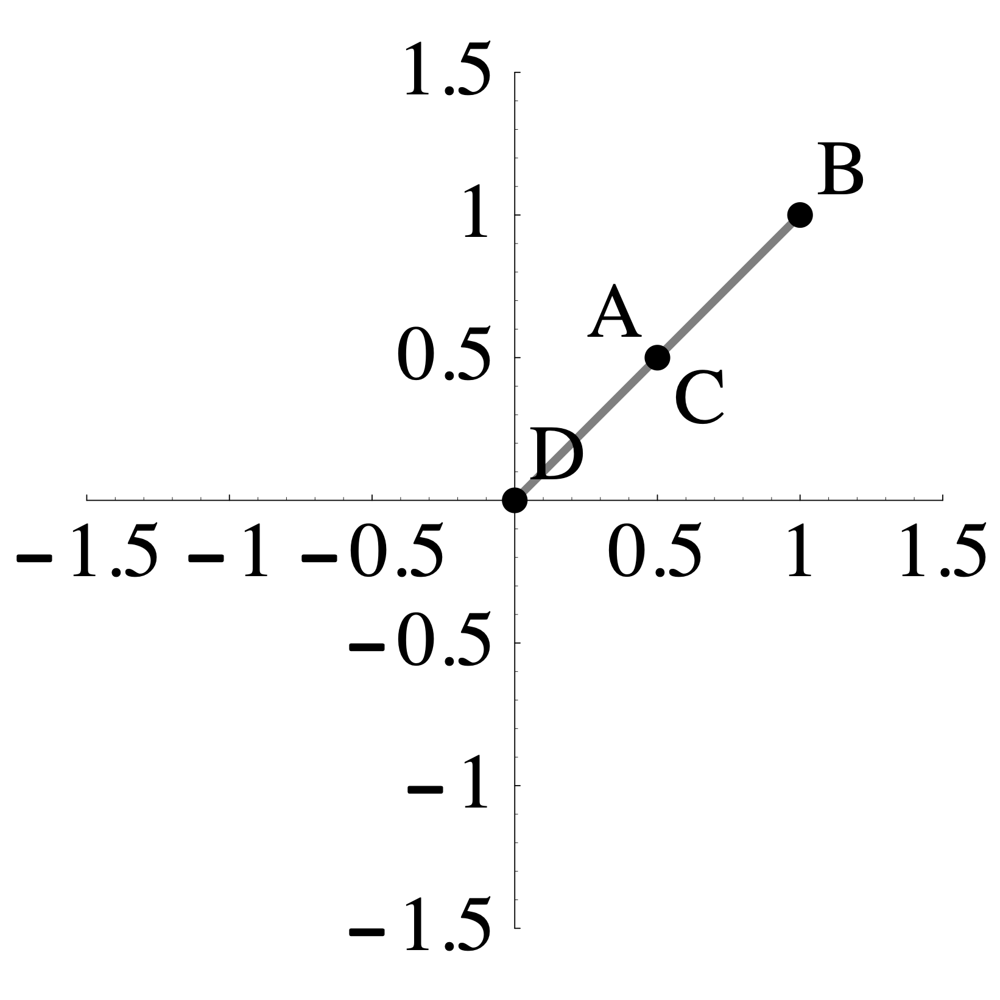

# Problem Set 4

* Due: Wednesday September 29 by midnight CST. 
* Upload your solutions to Moodle in a PDF. 
* Please feel free to **use RStudio for all row reductions.**
* You can download the [Rmd source file  for this problem set](https://github.com/Tom-Halverson/math236_f21/blob/main/PS4-problem-set-4.Rmd).

The Problem Set covers sections  1.9. The Matrix of a Linear Transformation and One-to-One and Onto, 2.1. Matrix Multiplication, and 2.2 Matrix Inverses.

## Matrix of a Linear Transformation

In each example below, find the matrix of the given linear transformation (all of these transformations are linear). Do this by finding where the transformation sends the standard basis vectors $\mathsf{e}_1,\mathsf{e}_2,\mathsf{e}_3, \ldots$.


a. The transformation $T$ is given by:
$$T \left( \begin{bmatrix}  x_1 \\ x_2 \\ x_3 \end{bmatrix}\right) =
\begin{bmatrix} x_3 \\ x_1 \\ x_2 \\\end{bmatrix}.
$$

b. The transformation $T$ is given by:
$$T \left( \begin{bmatrix}  x_1 \\ x_2 \\ x_3 \end{bmatrix} \right)= 
  \begin{bmatrix} x_1 \\ x_1 + x_2  \\ x_2 + x_3 \end{bmatrix} + 
  \begin{bmatrix} x_3 \\ x_3 \\ x_1 \\\end{bmatrix}
$$

c. The transformation $L: \mathbb{R}^2 \to \mathbb{R}^2$ sends the shaded region on the  left to the the shaded region on the right such that $A$ maps to $A$, $B$ maps to $B$, $C$ maps to $C$, and $D$ maps to $D$.

{width=30%} $\qquad \qquad$ {width=30%} 

d. The transformation $R: \mathbb{R}^2 \to \mathbb{R}^2$ sends the shaded region on the  left to the the shaded region on the right such that $A$ maps to $A$, $B$ maps to $B$, $C$ maps to $C$, and $D$ maps to $D$.

{width=30%} $\qquad \qquad$ {width=30%}


e. The transformation $T: \mathbb{R}^2 \to \mathbb{R}^2$ sends my house on the left to the house on the right.


{width=40%} $\qquad \qquad$ {width=40%}


## Matrix of a Nonlinear Transformation?

This problem illustrates what happens if you try to make the matrix of a transformation that is not linear. Consider the transformation $T$ defined below. We can see that it is nonlinear by the fact that one of the coordinates is squared and by the fact that it does not send 0 to 0.
$$
T \left( \begin{bmatrix} x_1 \\ x_2 \\ x_3 \end{bmatrix} \right)
=
\begin{bmatrix} x_1 + x_2^2 + x_3 \\ 2 x_2 + x_1 x_3 + 1 \\ 2 x_1 + 3 x_2 + x_3 \end{bmatrix}
$$
Now, let's see what happens if we compute a matrix for it anyway. Compute $T(\mathbf{e}_1)$, $T(\mathbf{e}_2)$, and $T(\mathbf{e}_3)$, and put the vectors you get in the columns of a matrix $A$. Then compute the product below:
$$
\underbrace{\begin{bmatrix} 
\cdot & \cdot & \cdot \\
\cdot & \cdot & \cdot \\
\cdot & \cdot & \cdot \\
\end{bmatrix}}_{A}
\begin{bmatrix} x_1 \\ x_ 2 \\ x_3 \end{bmatrix}
= 
$$
Explain how the result of this computation demonstrates that $T$ is not linear.

## Inner and Outer Products

I hope to give you some time to discuss this in class on Friday Sep 24.

We can also think of vectors as matrix. A column vector is an $n \times 1$ matrix and a row vector is a $1 \times n$ matrix. 

a. Compute the following products. These matrix products are called *inner products* (or dot products) of the vectors.


$$
\begin{bmatrix} 4 & -1 & 2 & 3\end{bmatrix}
\begin{bmatrix} 1 \\ 2 \\1  \\3  \\\end{bmatrix} = \qquad\qquad
\begin{bmatrix} 4 & -1 & 2 & 3\end{bmatrix}
\begin{bmatrix} 1 \\ 1 \\1  \\1  \\\end{bmatrix} = \qquad\qquad
\begin{bmatrix} 4 & -1 & 2 & 3\end{bmatrix}
\begin{bmatrix} 2 \\ 5 \\ 0  \\ -1  \\\end{bmatrix} = \qquad\qquad
$$
b. Now compute the following products. These are called *outer products*.  

$$
\begin{bmatrix} 1 \\ 2 \\1  \\3  \\\end{bmatrix}
\begin{bmatrix} 1 & -5 & 2 & 3\end{bmatrix} = \hskip3in
$$


$$
\begin{bmatrix} 1 \\ 2 \\1  \\3  \\\end{bmatrix}
\begin{bmatrix} 1 & 1 & 1 & 1\end{bmatrix} =\hskip3in
$$

c. Row reduce both of the matrices that you get in part b (this should be easy to do by hand,but you can use R if you want to). How many pivots do you get? Explain why you always get this number of pivots when you row reduce an outer product.


## Archaeological Seriation


There may be time to discuss this in class on Friday Sep 24.


The matrix $A$ below is used in  archaeological dating. Its rows correspond to four different grave sites $G_1, G_2, G_3, G_4$ and its columns correspond to five types of pottery$P_1, P_2, P_3, P_4, P_5$. There is a 1 in position $i$-$j$ if pottery type $P_j$ is found in grave $G_i$ (and a 0 otherwise).
$$
A=\begin{array}{c|ccccc}
& P_1 & P_2 & P_3 & P_4 & P_5 \\
\hline
 G_1 & 1 & 1 & 0 & 1 & 1 \\
G_2 &  0 & 0 & 1 & 0 & 1 \\
G_3 &  0 & 1 & 1 & 0 & 1 \\
G_4  & 1 & 1 & 1 & 1 & 1 \\
\end{array}
$$

a. Compute the matrix $\mathbf{G} = A A^T$, where $A^T$ is the *transpose* of $A$, meaning that the rows and columns have been interchanged.

b. Give the meaning of the $i$-$j$ entry of $\mathbf{G}$ (the entry in row $i$ and column $j$). State clearly the meaning of this entry using complete sentences (or sentence) and explain why it has this meaning.


## Rental Car

I hope to give you some time to work on this in class on Friday Sep 24. Solve this problem using R and turn in a markdown file knitted to html. 

A group of Macalester alumni open a rental car company specializing in  renting electric cars. As a start, they have opened offices in St. Paul, Rochester, and Duluth. Through market research they find that of the cars rented in St. Paul, 85% will get returned in St. Paul, 9% will get returned in Rochester, and 6% will get returned in Duluth. Of the cars rented in Rochester, 30% will get returned in St. Paul, 60% will get returned in Rochester, and 10% in Duluth. Of the cars rented in Duluth, 35% will get returned in St. Paul, 5% in Rochester, and 60% in Duluth. This information is represented in the matrix below.

```{r,echo=TRUE}
StP = c(.85,.09,.06)
Roch = c(.30,.60,.10)
Dul = c(.35,.05,.60) 
M = cbind(StP,Roch,Dul)
M
```
Such a matrix is called a *probability* matrix or a *stochastic* matrix because it  contains numbers between 0 and 1 and each of its columns sum to 1.

a. The owners are trying to use this data to estimate how much of their fleet will be at each location on average in the long run. Assume that initially they locate 20 cars in each city. This can be recorded by the vector `v0 = c(20,20,20)`. Apply, M to v0, call this vector v1, and explain, using how the matrix-vector product works, why v1 represents the number of cars at each location one day later (for simplicity, we assume that each rental is for 1 day).

b. Now apply M to v1 and call it v2. This should represent the number of cars at each location 2 days later. Also compute the square of the matrix M and call it M2. Confirm that M2 times v0 is the same as M times v1. 

c. Write a for loop that applies M over and over again to see what happens to the distribution of cars in the long-run. Does this sequence stabilize or does it keep changing after each application? If it does stabilize, how long does it take to stabilize (to within 0.1 cars at each location). See the [MatrixMultiplication.Rmd](https://drive.google.com/file/d/1JvlLvHyAvK3a1r2vdYBjs_WAxYf_wv64/view) activity we did in class as well as [Writing Loops].

d. Does the starting distribution matter? Try 4 different starting distributions (with a total of 60 cars) and see what the final distribution looks like in each case. For one of your 4 starting distributions, try all 60 cars at one of the locations.

## Rainy Day in LA

I hope to give you some time to discuss this in class on Monday Sep 24.

In Los Angeles if it rains today, there is a 50% chance it will rain tomorrow, but it if is sunny today, there is a 90% chance it will be sunny tomorrow. This is modeled in the rain-sunshine probability matrix P. 
$$
P = 
\begin{array}{c|cc|}
&\text{rain}&\text{sun}\\
\hline
\text{rain}&1/2&1/10\\
\text{sun}&1/2&9/10\\
\hline
\end{array}
$$
This matrix works as follows: if the rain-sunshine probability today is (40, 60) (that is, 40% chance rain and 60% chance sunshine), then the rain-sunshine probability tomorrow is (26, 74) as seen by the calculation below.
$$
\begin{bmatrix}
1/2 & 1/10 \\
1/2 & 9/10 \\
\end{bmatrix} \begin{bmatrix} 40 \\ 60 \end{bmatrix} = \begin{bmatrix} 26 \\ 74 \end{bmatrix}
$$

a. Find the rain-sunshine probability the day after tomorrow.

b. Compute $P^2$ and explain the meaning of each of the four entries in the matrix.

c. Find $P^{-1}$ and   and use it find the rain-sunshine probability *yesterday* if the rain-sunshine probability today is (40, 60).

