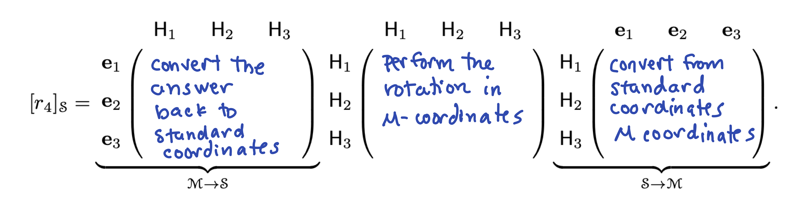

# Problem Set 6

* Due: Wednesday October 27 by 11:59pm CST. This is the Wednesday after Fall break. However, these problems cover topics that are on Exam 2. I will have you work on and discuss them before the exam. I hope that you can get it all done before break, but to take the pressure off writing it up, I will not have you turn it in until after break. There will be time in class to discuss and work on these. 
* Upload your solutions to Moodle in a PDF. 
* Please feel free to **use RStudio for all row reductions.**
* You can download the [Rmd source file  for this problem set](https://github.com/Tom-Halverson/math236_f21/blob/main/PS6-problem-set-6.Rmd).


## Dimension

Find the dimension of the subspace $Z$ of $\mathbb{R}^5$ of vectors below. Either use the method of "baking in" the conditions or turn it in to a null space and use our methods of finding a null space basis.
$$
Z = \left\{
\begin{bmatrix}x_1 \\ x_2 \\ x_3 \\ x_4 \\ x_5 \end{bmatrix}
\ \Bigg\vert\ \  x_1 + x_2 + x_3 + x_4 + x_5 = 0, x_4 = 2 x_2 \ 
\right\}.
$$

## A Tetrahedral Basis

In practice, we change bases because problems are computationally easier in another coordinate system or because we learn something by looking at a problem from the point of view of a different coordinate system. The following example illustrates this with ideas that arises both in chemistry and computer graphics. Below is the tetrahedral molecule methane, $\mathsf{CH}_4$. Its coordinates can be described in 3-dimensional space by the vectors below.

$$
\mathsf{C}=\begin{bmatrix} 0 \\ 0 \\ 0 \end{bmatrix},
\mathsf{H}_1=\begin{bmatrix} 0 \\ 0 \\ \frac{3}{2\sqrt{6}} \end{bmatrix},
\mathsf{H}_2=\begin{bmatrix}
 -\frac{1}{2 \sqrt{3}} \\ -\frac{1}{2} \\ -\frac{1}{2 \sqrt{6}}
\end{bmatrix},
\mathsf{H}_3=\begin{bmatrix}
 -\frac{1}{2 \sqrt{3}} \\ \frac{1}{2} \\ -\frac{1}{2 \sqrt{6}} 
 \end{bmatrix},
\mathsf{H}_4=\begin{bmatrix}
 \frac{1}{\sqrt{3}} \\0 \\-\frac{1}{2 \sqrt{6}}
 \end{bmatrix}
$$

{width=35%}

Let $\mathcal{M} = \{ \mathsf{H}_1, \mathsf{H}_2, \mathsf{H_3} \}$. Then $\mathcal{M}$ is a basis of $\mathbb{R}^3$, which we will call the **tetrahedral basis.** You can see from the plot that these vectors are linearly independent (not all on the same plane)

a. Express $\mathsf{H}_4$ in the tetrahedral basis. Hint: first compute $\mathsf{H}_1+\mathsf{H}_2+\mathsf{H}_3+\mathsf{H}_4$ using the coordinates above. You do not need to do any row reductions for this question (but you can).

```{r,echo=TRUE}
H1 = c(0,0,3/(2*sqrt(6)))
H2 = c(-1/(2*sqrt(3)),-1/2,-1/(2*sqrt(6)))
H3 = c(-1/(2*sqrt(3)),1/2,-1/(2*sqrt(6)))
H4 = c(1/sqrt(3),0,-1/(2*sqrt(6)))
```


b. Give the change of basis matrix $T$ that converts from the tetrahedral basis $\mathcal{M}$ to the standard basis $\mathcal{S}$ and compute its inverse that converts from the standard basis back to $\mathcal{M}$.

c. Chemists are interested in symmetry operations. These are linear transformations such that the atom looks the same after the transformation as it did before. For example one such operation is rotation $r_4$ by 120$^o$ around the  $\mathsf{H}_4$ axis. This rotation sends $\mathsf{H}_1$ to $\mathsf{H}_3$, $\mathsf{H}_3$ to $\mathsf{H}_2$, and $\mathsf{H}_2$ to $\mathsf{H}_1$. Give the matrix of $r_4$  in the $\mathcal{M}$ basis.

```{r,echo=TRUE}
r4.M = cbind(c(0,0,0),c(0,0,0),c(0,0,0))
rownames(r4.M) <- c("H1","H2","H3")
colnames(r4.M) <- c("H1","H2","H3")
r4.M
```

d. It is a pain to describe these transformations in the standard basis, but it is easy and elegant to do so in the methane basis. We can now use the change-of-basis matrix to get the matrix in the standard basis. Compute the rotation in the standard basis by multiplying out these matrices in R. Use your matrices from parts b and c.

{width=100%}

e. Give the matrix in the $\mathcal{M}$-basis for the following symmetry transformations: (ii) The rotation $r_2$ around the $\mathsf{H}_2$ axis sending $\mathsf{H}_1$ to $\mathsf{H}_3$, $\mathsf{H}_3$ to $\mathsf{H}_4$, and $\mathsf{H}_4$ to $\mathsf{H}_1$. (iii) The reflection $\sigma_{1,2}$  across the plane containing $\mathsf{H}_1, \mathsf{H}_2,$ and $\mathsf{C}$. You do not need to give these in standard coordinates.


## Matrix Rank

Fill in the entries of the table  with **T** = true or **F** = false or I** = not enough information to know. (Hint: draw a "picture" of the RREF of $\mathsf{A}$ in each case).  

**(a)** $\mathsf{A}$ is invertible

**(b)** $\mathsf{rref}(\mathsf{A}) = I$

**(c)** $\mathsf{A}$ has 8 pivots

**(d)** $\mathsf{A} \mathbf{0} = \mathbf{0}$ 

**(e)** $\mathsf{A} \mathsf{x} = \mathbf{0}$ has more than one solution.

**(f)** $T$ is one-to-one

**(g)** $T$ is onto

**(h)** $\mathsf{A} \mathsf{x} = \mathsf{b}$ has at least one solution for all $\mathsf{b} \in \mathbb{R}^8$.

**(i)** The columns of $\mathsf{A}$ span $\mathbb{R}^8$.

**(j)** There is a vector $\mathsf{b} \in \mathbb{R}^8$ such that $\mathsf{A} \mathsf{x} = \mathsf{b}$ has no solutions.

**(k)** There is a vector  $\mathsf{b} \in \mathbb{R}^8$ such that $\mathsf{A} \mathsf{x} = \mathsf{b}$ has infinitely many solutions.

**(l)** There is a vector $\mathsf{b} \in \mathbb{R}^8$ such that $\mathsf{A} \mathsf{x} = \mathsf{b}$ has exactly 17 solutions.

**(m)** There is a vector $b \in \mathbb{R}^8$ that can be written as a linear combination of the columns of $\mathsf{A}$ in more than one way.

**(n)** The rows of $\mathsf{A}$ span a 7 dimensional subspace of $\mathbb{R}^8$.

**(o)** The columns of $\mathsf{A}$ are linearly independent.

**(p)** The rows of $\mathsf{A}$ are linearly independent 


$$
\begin{array}{|c|c|c|c|c|}
\hline
& T: \mathbb{R}^8 \to \mathbb{R}^8  & T: \mathbb{R}^8 \to \mathbb{R}^8 & T: \mathbb{R}^7 \to \mathbb{R}^8  & T: \mathbb{R}^9 \to \mathbb{R}^8  \\
&  \text{$\mathsf{A}$  has rank 7} & \text{$\mathsf{A}$ has rank 8} & \text{$\mathsf{A}$  has rank 7} &  \text{$\mathsf{A}$  has rank 8} \\
\hline
(a) & & & & \\ \hline
(b) & & & & \\ \hline
(c) & & & & \\ \hline
(d) & & & & \\ \hline
(e) & & & & \\ \hline
(f) & & & & \\ \hline
(g) & & & & \\ \hline
(h) & & & & \\ \hline
(i) & & & & \\ \hline
(j) & & & & \\ \hline
(k) & & & & \\ \hline
(l) & & & & \\ \hline
(m) & & & & \\ \hline
(n) & & & & \\ \hline
(o) & & & & \\ \hline
(p) & & & & \\ \hline
\end{array}
$$

## A Tale of Two Bases


I recommend using R on this problem. Consider the subspace $S$ of $\mathbb{R}^5$ below.
$$
S = \textsf{span}\left(
\begin{bmatrix}
 1  \\
 1  \\
 1  \\
 1  \\
 2  \\
\end{bmatrix},
\begin{bmatrix}
1  \\
2  \\
3  \\
0  \\
-1 \\
\end{bmatrix},
\begin{bmatrix}
0  \\
0  \\
0 \\
1  \\
 2  \\
\end{bmatrix},
\begin{bmatrix}
 -1  \\
 1  \\
 3  \\
 0  \\
 -2  \\
\end{bmatrix},
\begin{bmatrix}
2 \\
1 \\
 0 \\
  1 \\
 3 \\
\end{bmatrix}
\right)
$$
```{r,echo=TRUE}
A = cbind(c(1,1,1,1,2),c(1, 2, 3, 0, -1),c(0, 0, 0, 1, 2), c(-1, 1, 3, 0, -2),c(2, 1, 0, 1, 3))
```

a. Give a basis of $S$ consisting of some or all of the vectors used to define $S$ above. 

b. Give a basis of $S$ that has the nice standard basis property (i.e., the 0s and 1s property).

c. For the two vectors below, decide if they are in $S$. If the vector is in $S$ then give its coordinates in each of your bases from parts (a) and (b). If you can do one of these "by hand" then explain how.
$$
\mathbf{w} = \begin{bmatrix} 8 \\ 11 \\ 14 \\ 7 \\ 11 \end{bmatrix}, \qquad 
\mathbf{v} = \begin{bmatrix} 3 \\ 3 \\ 3 \\ 1 \\ 1 \end{bmatrix}.
$$

## Homogeneous Coordinates

This will not be on the exam, and we will do it in class on Monday after break.
