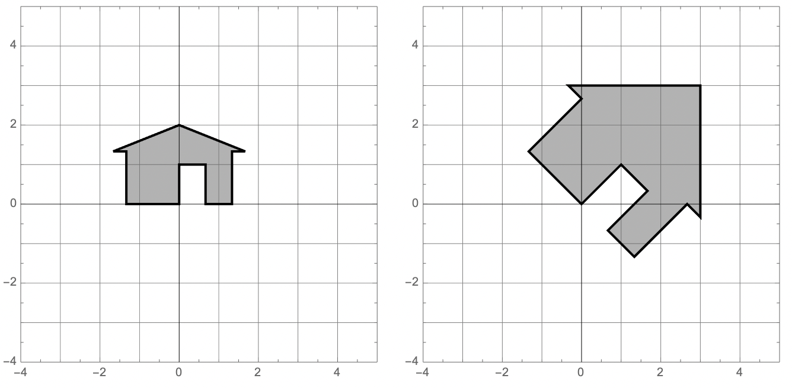

# (PART) Quiz Review {-}

# Exam 1 Review

\newcommand{\RR}{\mathbb{R}}
\newcommand{\A}{\mathsf{A}}

## Overview

Our first exam covers sections 1.1 - 2.3 in Lay's book.This corresponds to Problem Sets 1-4. 

* I will hand it out right away, even a few minutes early, so you can start right on time.
* You must turn it in by 9:35 (for the 8:30 class) and  10:45 for the 10:50 class). No exceptions. The next class needs to come in and get started.
* No calculators are allowed, and none are needed.
* If row reductions are needed, they will be easy (integer) calculations, and there will not be many.
* It will be closed book but you can bring a 3" x 5" notecard with notes written on both sides. These notes should be hand written by you. You do not need to turn in the note card with the exam.
* There will be some basic calculations, but the problems will focus more on the ideas than on the calculations.
* I will ask some problems that are very similar to homework problems, Edfinity problems, and examples from class or the videos.
* I will ask other problems that are somewhat different from things you have done. On these, you are to apply your knowledge in a slightly new setting to demonstrate an even higher mastery of the material.
* You will be allowed to re-write one problem to earn back half of the points that you lost. This will be due the class period after I hand the exam back.
* The exam is worth 12% of your course grade as outlined in the [syllabus](https://docs.google.com/document/d/1uE95uWoV994QJ6YyrR7yBMV7MATzYO6XI4xd_q4-sqc).


### Vocabulary and Concepts

You should understand these concepts and be able to read and use these terms correctly (see also the [important definitions]):

* elementary row operations 
* REF and RREF and pivot positions
* linear combination
* span
* linear independence
* homogeneous and nonhomogeneous equations
* Understand the geometric relationship between the solutions to $Ax = 0$ and $Ax=b$
* Understand Theorem 4 in Section 1.4 which says that the following are equivalent (they are all true or are all false) for an $m \times n$ matrix $A$
    + For each $b$ in $\mathbb{R}^m$, $A x = b$ has a solution
    + Each $b$ in $\mathbb{R}^m$ is a linear combination of the columns of $A$
    + The columns of $A$ span $\mathbb{R}^m$
    + $A$ has a pivot in every row.
* The columns of $A$ are linearly independent if and only if $Ax=0$ only has the trivial solution
* Understand Theorem 8 in Section 1.7: if you have more than $n$ vectors in $\mathbb{R}^n$ they must be linearly dependent.
* linear transformations
* the matrix of a linear transformation
* One-to-one and onto
* Matrix Multiplication
* Matrix Inverses
* [The Invertible Matrix Theorem](https://moodle.macalester.edu/pluginfile.php/59258/mod_resource/content/1/IVT.pdf)

### Skills

You should be able to perform these linear algebra tasks.

* Identify linear systems from nonlinear systems
* Make the augmented matrix from a set of equations
* Row reduce a system of equations into Row Echelon Form (REF) and Reduced Row Echelon Form (RREF)
* Write the solution set to $Ax=b$ as a parametric vector equation.
* Convert back and forth between systems of equations, vector equations, and matrix equations.
* Compute the matrix-vector product $Ax$
* Determine whether a set of vectors is linearly dependent or independent
* Find a dependence relation among a set of vectors
* Decide if a set of vectors span $\mathbb{R}^n$
* Manipulate matrix vector products using: $A(x + y) = Ax + Ay$ and $A(c x) = c A x$
* Determine if a function $T: \mathbb{R}^n \to \mathbb{R}^m$ is linear.
* Find the matrix of a linear transformation $T$.
* find a matrix inverse
* solve equations using matrix inverses

## Practice Problems


###

I have performed some row operations below for you on a matrix $A$. Write out the complete set of solutions to $A \mathsf{x} = {\bf 0}$.
$$
A=
\begin{bmatrix}
1& 2& 0& 2& 0& -1 \\
1& 2& 1& 1& 0& -2 \\
2& 4& -2& 6& 1& 2 \\
1& 2&  0& 2& -1& -3 \\
\end{bmatrix} \longrightarrow
\begin{bmatrix}
1& 2& 0& 2& 0& -1\\
0& 0& 1& -1& 0& -1\\
0& 0& 0& 0& 1& 2\\
0& 0& 0& 0& 0& 0\\
\end{bmatrix}
$$   

###

I have performed some row operations below for you on a matrix $B$.
$$
B=
\begin{bmatrix}
1& 1& 0 \\ 0& 1& 1 \\ 2& 1& 2 \\ 1& -1& 1 \\ 2& 3& 1 \\
\end{bmatrix}
\longrightarrow
\begin{bmatrix}
1& 0& 0 \\ 0& 1& 0 \\ 0& 0& 1 \\ 0&0&0 \\ 0&0&0 \\
\end{bmatrix} 
$$

a. Describe the solutions to the equation $B \mathsf{x} = {\bf 0}$.

b. Fill in the boxes: the transformation $T(\mathsf{x}) = B\mathsf{x}$ is a linear transformation from $\mathbb{R}^{\square}$ to $\mathbb{R}^{\square}$.

c. Are the columns of $B$ linearly independent or dependent?

d. Do the columns of $A$ span $\mathbb{R}^5$?

e. Is the transformation $T$ one-to-one? Is it onto?

###

I want to know if it is possible to write $\mathsf{w}$ as a linear combination of the vectors $\mathsf{v}_1, \mathsf{v}_2, \mathsf{v}_3$ below. Write down,
**but do not solve**, a matrix equation that would solve this problem.  Your answer should be of the form $A \mathsf{x} = \mathsf{b}$, where I can clearly see what $A, \mathsf{x}$, and $\mathsf{b}$ are. I should also be able to tell how many unknowns there are.
$$
\mathsf{v}_1 = \left[ \begin{matrix} 1 \\  2 \\ 3 \\ 4 \\  \end{matrix}\right] ,  \quad
\mathsf{v}_2 = \left[ \begin{matrix} 1 \\  0 \\ 1 \\ 0 \\  \end{matrix}\right] ,  \quad
\mathsf{v}_3 = \left[ \begin{matrix} 1 \\  1 \\ 0 \\ -2 \\  \end{matrix}\right] ,  \quad
\mathsf{w} = \left[ \begin{matrix} 1 \\  -8 \\ -11 \\ -24 \\  \end{matrix}\right] . 
$$

###

Describe all vectors that are not in the span of the columns of the matrix $A$ below:
$$
A=
\begin{bmatrix}
1& 2& 4  \\
-3& -5& -11\\
1& 1& 3 \\
\end{bmatrix}
$$

###

The matrix below is $3 \times 3$ but the third column is missing.    Add a nonzero third column so that the columns of  $A$ are linearly dependent and add a 3rd column so that the columns of $A$ are linearly independent. Briefly describe your strategy.
$$
\begin{bmatrix}
1& 0 & \quad \\
0& 1& \quad \\
2& 2& \quad \\
\end{bmatrix}  \qquad\qquad 
\begin{bmatrix}
1& 0 & \quad \\
0& 1& \quad \\
2& 2& \quad \\
\end{bmatrix}
$$

###

In each case below, find the **matrix** of the linear transformation that is described, if you believe that the matrix exists. Otherwise, demonstrate that the transformation is **not linear**.  

a. The transformation $T$ is given by:
$$T \left( \begin{bmatrix}  x_1 \\ x_2 \\ \end{bmatrix}\right) = 
\begin{bmatrix} x_1 + x_2 \\ 2 x_1 \\ -x_2 \\\end{bmatrix}.
$$

b. The transformation $T$ is given by:
$$T \left( \begin{bmatrix}  x_1 \\ x_2 \\ x_3 \end{bmatrix} \right)= 
  \begin{bmatrix} x_1 + x_2 + x_3 \\  x_1 x_2 \\ -x_2 + 2 x_3 \end{bmatrix}.
$$


###

Write the following systems of equations in vector and matrix form.

$$
\begin{array} {ccccccccccc}
5 x_1 &+& 3 x_2 &+& x_3 &+& 11 x_4 &-&  x_5 &=& 10 \\
4 x_1 &+& x_2 &+& 3 x_3 &+& 2 x_4 &+& 6 x_5 &=& 11 \\
- x_1 &+& 3 x_2 &-& 2 x_3 &+&  x_4 &+& 6 x_5 &=& 12 \\
\end{array} 
$$


###

Let $\mathsf{v}_1, \mathsf{v}_2, \mathsf{v}_3, \mathsf{v}_4$ be the vectors in the  columns of the matrix $A$ below.
$$
A = \left[
\begin{array}{cccc}
 1 & 1 & 3 & 1 \\
 2 & 0 & 2 & 3 \\
 1 & 1 & 3 & 1 \\
 -1 & 0 & -1 & 0
\end{array}
\right]
\longrightarrow
\left[
\begin{array}{cccc}
 1 & 0 & 1 & 0 \\
 0 & 1 & 2 & 0 \\
 0 & 0 & 0 & 1 \\
 0 & 0 & 0 & 0
\end{array}
\right]
$$
a. Are the vectors  $\mathsf{v}_1, \mathsf{v}_2, \mathsf{v}_3, \mathsf{v}_4$ linear independent or dependent? If they are linearly dependent, please give a dependence relation among them. 
b. Describe the span of the vectors $\mathsf{v}_1, \mathsf{v}_2, \mathsf{v}_3, \mathsf{v}_4$ inside of $\mathbb{R}^4$?


###

Find a solution to $A \mathsf{x}=0$ that no one else in the class has.
$$
A = 
\begin{bmatrix}
 1 & 1 & 1 & 1 & 4 \\
 2 & 0 & 4 & 1 & 4 \\
 1 & 1 & 1 & 1 & 4 \\
 1 & 0 & 2 & 1 & 3
\end{bmatrix}
 \longrightarrow 
\begin{bmatrix}
 1 & 0 & 2 & 0 & 1 \\
 0 & 1 & -1 & 0 & 1 \\
 0 & 0 & 0 & 1 & 2 \\
 0 & 0 & 0 & 0 & 0
\end{bmatrix}
$$

### 

**oops!** sorry! I uploaded the wrong house. I will fix it tonight!

Explain why it is *not* possible for a linear transformation $T: \mathbb{R}^2 \to \mathbb{R}^2$ to transform my hous as seen below:

{width=90%}

###

Consider the following vectors in $\mathbb{R}^3$: 
$$
\v_1 = \begin{bmatrix} 1  \\-1  \\1  \\ \end{bmatrix},
\v_2 = \begin{bmatrix} 0 \\ 1 \\ 1 \\ \end{bmatrix},
\v_3 = \begin{bmatrix} 3 \\ -1 \\ 5 \\ \end{bmatrix}.
$$

a. Determine whether the set $\{\v_1, \v_2, \v_3\}$ is linearly independent or linearly dependent. If it is dependent, give a dependence relation. If it is independent show the work that justifies this conclusion.

b. Find a vector $\b \in \RR^3$ that is *not* in $\mathsf{span}(\v_1,\v_2,\v_3)$. Justify your answer.

c. If $T: \RR^3 \to \RR^3$ is a linear transformation such that $T(\v_1) = \v_2$ and $T(\v_2) = \v_3$ then compute $T(\v_3)$.

###

Below is the row reduction of the augmented matrix for the equation $\A x = \b$.
$$
[\A \mid \b ] =
\left[\begin{array}{ccccc|c}
 1 & 1 & -1 & 1 & 4 & 2 \\
 2 & -1 & -5 & -3 & -3 & 2 \\
 1 & 1 & -1 & 0 & 3 & 1 \\
 1 & 1 & -1 & 1 & 4 & 2 \\
\end{array}\right] 
\longrightarrow 
\left[\begin{array}{ccccc|c}
 1 & 0 & -2 & 0 & 1 & 2 \\
 0 & 1 & 1 & 0 & 2 & -1 \\
 0 & 0 & 0 & 1 & 1 & 1 \\
 0 & 0 & 0 & 0 & 0 & 0 \\
\end{array}\right] \hskip5in
$$


a. Give the general solution to $\A x = \b$ in parametric form.

b. Describe geometrically the general solution you gave in part (a) ( e.g., a single point in $\RR^3$, a line in $\RR^2$, a plane in $\RR^4$, a three dimensional space in $\RR^9$).

c. If $T$ is the linear transformation whose matrix is $\A$, then $T: \R^{\square} \to \R^{\square} $ (fill in the blanks).

d. Determine if these statements are true **T**, false **F**, or that there is not enough information,  **I**,  to decide. No justification needed.


    i. $T$ is one-to-one
    i. $T$ is onto
    i. $\A x = \b$ has a solution for all $\b$ in the codomain.
    i. $\A x = \b$ has exactly one solution for some $\b$ in the
    i. The columns of $\A$ are linearly independent.
    i. The columns of $\A$  span $\RR^4$.
    i. The 3rd column of $\A$ is in the span of the first 2 columns of $\A$.


###

Given that $A,B,C$ are invertible matrices, solve the following matrix equation for $X$ 
$$
C (A  + X) B^{-1} = I 
$$

###

We've seen a few problems that ask you to interpret the meaning of matrix multiplication: the rental car problem, the rain-sunshine matrix, and the graves and pottery matrix. Here is another problem in which the goal is to interpret the meaning of matrix multiplication. 

Here is a graph of the network of domestic airline flights in Korea. They are not located geographically in the plane, but there is a connection if there is a direct flight from one airport to the other.


```{r,message=FALSE,echo=FALSE,fig.height=8, fig.width=8}
library(igraph)
airports = c("1-Seoul-ICN","2-Busan","3-Seoul-GMP","4-Yangyang","5-Daegu","6-Jeju","7-Gwangju","8-Yeosu","9-Sacheon","10-Ulsan","11-Pohang","12-Gunsan")
A = rbind(c(0,1,0,0,1,0,0,0,0,0,0,0),
c(1,0,1,1,0,1,0,0,0,0,0,0),
c(0,1,0,0,1,0,1,1,1,1,1,0),
c(0,1,0,0,0,1,0,0,0,0,0,0),
c(1,0,1,0,0,1,0,0,0,0,0,0),
c(0,1,0,1,1,0,1,1,1,1,0,1),
c(0,0,1,0,0,1,0,0,0,0,0,0),
c(0,0,1,0,0,1,0,0,0,0,0,0),
c(0,0,1,0,0,1,0,0,0,0,0,0),
c(0,0,1,0,0,1,0,0,0,0,0,0),
c(0,0,1,0,0,0,0,0,0,0,0,0),
c(0,0,0,0,0,1,0,0,0,0,0,0))
g=graph_from_adjacency_matrix(A,mode='undirected')
coords = layout_with_fr(g)
V(g)$label = airports
plot(g, vertex.color='gray', layout=coords,vertex.frame.color="dodgerblue")
```
It is common to study these networks using a matrix called the **adjacency matrix**. Here is the adjacency matrix of this network.

```{r,echo=TRUE}
A = rbind(c(0,1,0,0,1,0,0,0,0,0,0,0),c(1,0,1,1,0,1,0,0,0,0,0,0),
c(0,1,0,0,1,0,1,1,1,1,1,0),c(0,1,0,0,0,1,0,0,0,0,0,0),
c(1,0,1,0,0,1,0,0,0,0,0,0),c(0,1,0,1,1,0,1,1,1,1,0,1),
c(0,0,1,0,0,1,0,0,0,0,0,0),c(0,0,1,0,0,1,0,0,0,0,0,0),
c(0,0,1,0,0,1,0,0,0,0,0,0),c(0,0,1,0,0,1,0,0,0,0,0,0),
c(0,0,1,0,0,0,0,0,0,0,0,0),c(0,0,0,0,0,1,0,0,0,0,0,0))
A
```

a. Look at the location of the 0s and 1s in this matrix in the context of the network and decide when there is a 1 in the matrix.
b. Let $v$ be the vector in $\mathbb{R}^{12}$ consisting of all 1s. Multiply $Av$ and decide what the entries of this vectors tell us about the network.
c. Square the matrix, i.e., compute $A^2$. This amounts to dotting the rows of $A$ with the columns of $A$. Decide what the entries of $A^2$ mean in terms of the network.
d. Multiply $A^2$ by the all 1s vector $v$. What do the entries of that vector mean.

###

Suppose that you are given four linearly dependent vectors, $\v_1, \v_2, \v_3, \v_4$, in $\RR^n$. And suppose that you have a linear transformation $T: \RR^n \to\RR^m$.

a. State precisely what it means for $\v_1, \v_2, \v_3, \v_4$  to be linearly dependent.
b. Apply $T$ to your answer to a and use it to show that $T(\v_1), T(\v_2), T(\v_3), T(\v_4)$ must also be linearly dependent in $\RR^m$. This problem shows that linear transformations send dependent vectors to dependent vectors.

### Challenge

Prove that if $\v_1, \v_2, \v_3, \v_4$ are linearly independent in $\RR^n$ and $T: \RR^n \to \RR^m$ is one-to-one, then $T(\v_1), T(\v_2), T(\v_3), T(\v_4)$ are linearly independent in $\RR^m$

Note: I won't ask anything this hard on the exam but we are going to start doing proofs like this after exam 1.


## Solutions to Practice Problems

###

The parametric vector form of the solution is 

$$\begin{bmatrix}
x_1 \\ x_2 \\ x_3 \\ x_4 \\ x_5 \\ x_6 \\
\end{bmatrix} = s \begin{bmatrix}
-2 \\ 1 \\ 0 \\ 0 \\0  \\ 0
\end{bmatrix}
+ t \begin{bmatrix}
-2 \\ 0 \\ 1 \\ 1 \\0  \\ 0
\end{bmatrix}
u \begin{bmatrix}
1 \\ 0 \\ 1 \\ 0 \\-2  \\ 1
\end{bmatrix}$$

###


a. There is one solution: $\mathsf{x} = \begin{bmatrix} 0 \\ 0 \\ 0 \end{bmatrix}$.
b. The transformation $T(\mathsf{x}) = B\mathsf{x}$ is a linear transformation from $\mathbb{R}^{3}$ to $\mathbb{R}^{5}$.
c. Independent
d. Do not span
e. One-to-one but not onto.
  
###

$$
\begin{bmatrix}
1 & 1 & 1 \\
2 & 0 & 1 \\
3 & 1 & 0 \\
4 & 0 & -2
\end{bmatrix}
\begin{bmatrix}
x_1 \\ x_2 \\ x_3
\end{bmatrix}
=
\begin{bmatrix}
1 \\ -8 \\ -11 \\ -24
\end{bmatrix}
$$

###

 We want to find all target vectors $\mathsf{b}$ such that $A \mathsf{x} = \mathsf{b}$ is inconsistent. So we want the augmented matrix $\begin{bmatrix} A \,| \, b \end{bmatrix}$ to have a pivot in the last column.
$$
\left[ \begin{array}{ccc|c}
1& 2& 4 & b_1 \\
-3& -5& -11 & b_2\\
1& 1& 3 & b_3 \\
\end{array} \right]
\longrightarrow
\left[ \begin{array}{ccc|c}
1& 2& 4 & b_1 \\
0& 1& 1 & 3b_1 +b_2\\
0& -1& -1 & -b_1+b_3 \\
\end{array} \right]
\longrightarrow
\left[ \begin{array}{ccc|c}
1& 2& 4 & b_1 \\
0& 1& 1 & 3b_1 +b_2\\
0& 0& 0 & 2b_1+b_2+b_3 \\
\end{array} \right]
$$
So the set of target vectors that are not in the span of the columns of $A$ are the vectors
$$
\begin{bmatrix}
b_1 \\ b_2 \\ b_3
\end{bmatrix}
\qquad \mbox{where} \qquad
2b_1 + b_2 + b_3 \neq 0.
$$

###

In the first case, add a vector that is in the span of the first two vectors. For example, you might add the sum of the two vectors. In the second case, add a vector that is not in the span of the two vectors. Add something that row reduces to the identity.


###
 
a. This is a linear transformation with 
$$A = \begin{bmatrix} 1 & 1 \\ 2 & 0 \\ 0 & -1 \end{bmatrix}.$$
b. This is not a linear transformation because
$$
2 \, T \left( \begin{bmatrix} 1 \\ 1 \\ 1 \end{bmatrix} \right)= 2 \begin{bmatrix} 3 \\ 1 \\ 1 \end{bmatrix} = \begin{bmatrix} 6 \\ 2 \\ 2 \end{bmatrix} \quad \mbox{while} \quad 
T \left( \begin{bmatrix} 2 \\ 2 \\ 2 \end{bmatrix} \right)= 2 \begin{bmatrix} 6 \\ 4 \\ 2 \end{bmatrix}.
$$

###

 Vector Form:
$$
x_1 \begin{bmatrix} 5 \\ 4 \\ -1 \end{bmatrix} + 
x_2 \begin{bmatrix} 3 \\ 1 \\ 3 \end{bmatrix} + 
x_3 \begin{bmatrix} 1 \\ 3 \\ -2 \end{bmatrix} + 
x_4 \begin{bmatrix} 11 \\ 2 \\ 1 \end{bmatrix} + 
x_5 \begin{bmatrix} -1 \\ 6 \\ 6 \end{bmatrix} =
 \begin{bmatrix} 10 \\ 11 \\ 12 \end{bmatrix} 
$$
Matrix Form:
$$
\begin{bmatrix} 
5 & 3 & 1 & 11 & -1 \\
4 & 1 & 3 & 2 & 6 \\
-1 & 3 & -2& 1 & 6
\end{bmatrix} 
 \begin{bmatrix} x_1 \\ x_2 \\ x_3 \\ x_4 \\ x_5 \end{bmatrix} 
 =
 \begin{bmatrix} 10 \\ 11 \\ 12 \end{bmatrix} 
$$

###

a. $-\mathsf{v}_1 - 2\mathsf{v}_2 + \mathsf{v}_3 + 0 \mathsf{v}_4 = 0$.
b. $\mathrm{span}(\mathsf{v}_1,\mathsf{v}_2,\mathsf{v}_3,\mathsf{v}_4)$ looks like a copy of $\mathbb{R}^3$ sitting inside $\mathbb{R}^4$. In other words, is 3-dimensional subset of $\mathbb{R}^4$. 

###

 The general solution is
$$
\begin{bmatrix}
x_1 \\ x_2 \\ x_3 \\ x_4 \\ x_5
\end{bmatrix}
= s \begin{bmatrix} -2 \\ 1 \\ 1 \\ 0 \\ 0 \end{bmatrix}
+ t \begin{bmatrix} -1 \\ -1 \\ 0 \\ -2 \\ 1 \end{bmatrix}.
$$
My solution is
$$77,083,679 
\begin{bmatrix}
-2 \\ 1 \\ 1 \\ 0 \\ 0
\end{bmatrix}
- 72,159,215 
\begin{bmatrix}
-1 \\ -1 \\ 0 \\ -2 \\ 1
\end{bmatrix}.
$$

###

Hint: Look at the relation of the peak of the house to $\mathsf{e}_1$ and $\mathsf{e}_2$.

###

This one might be too much row-reduction for an in-class exam. Not sure. But these ideas are important. 

a. They are dependent. Find a nonzero solution to $A x = 0$ to get a dependence relation. 
b. You can augment with a symbolic vector $[b_1,b_2,b_3]$ and row reduce. This will give you a formula telling you what conditions on $b_1,b_2,b_3$ are needed for the equation to be inconsistent. You could also guess a strange choice for $b$ and row reduce to show that it is not in the span. 
c. Use the dependence relation.

###

a. 
b. Two free variables, so it is a plane in $\mathbb{R}^5$.
c. $\mathbb{R}^5 \to \mathbb{R}^4$.
d. F, F, F, F, F, F, T. Not (col3) = -2(col1) + (col2), which can be seen from the RREF.

###

Will do it in class on Wednesday.

###

Will discuss it in class on Wednesday.

