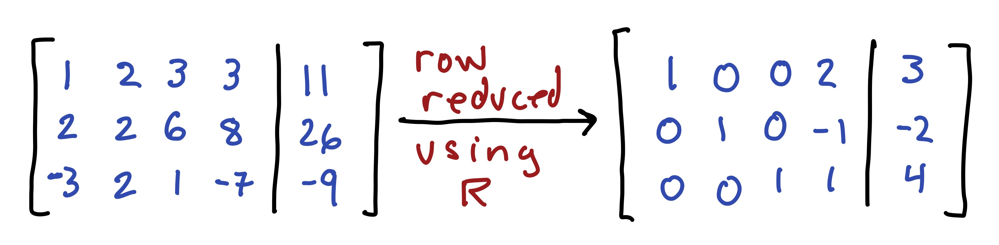
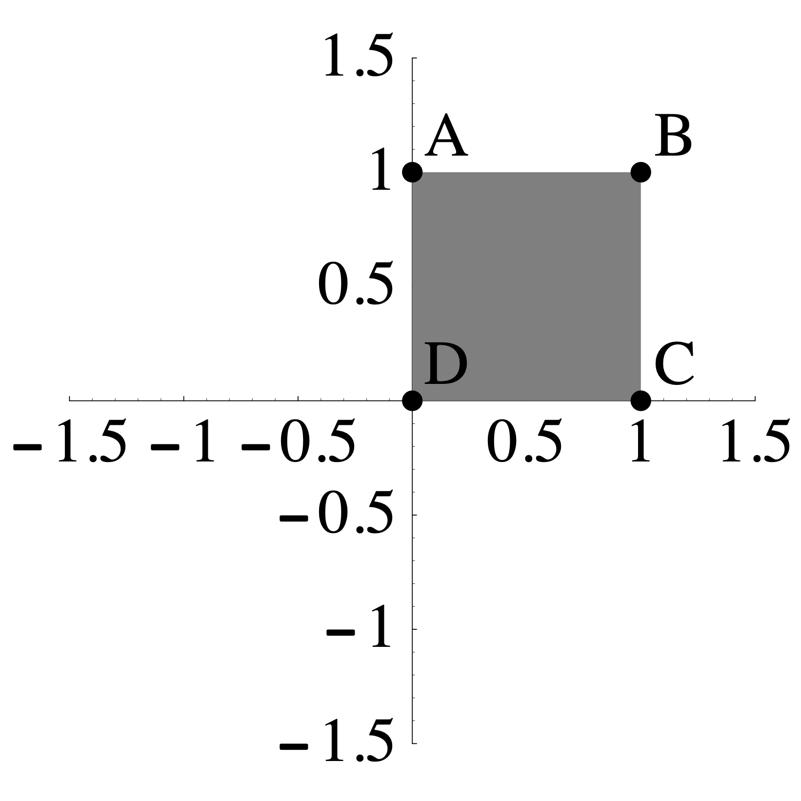
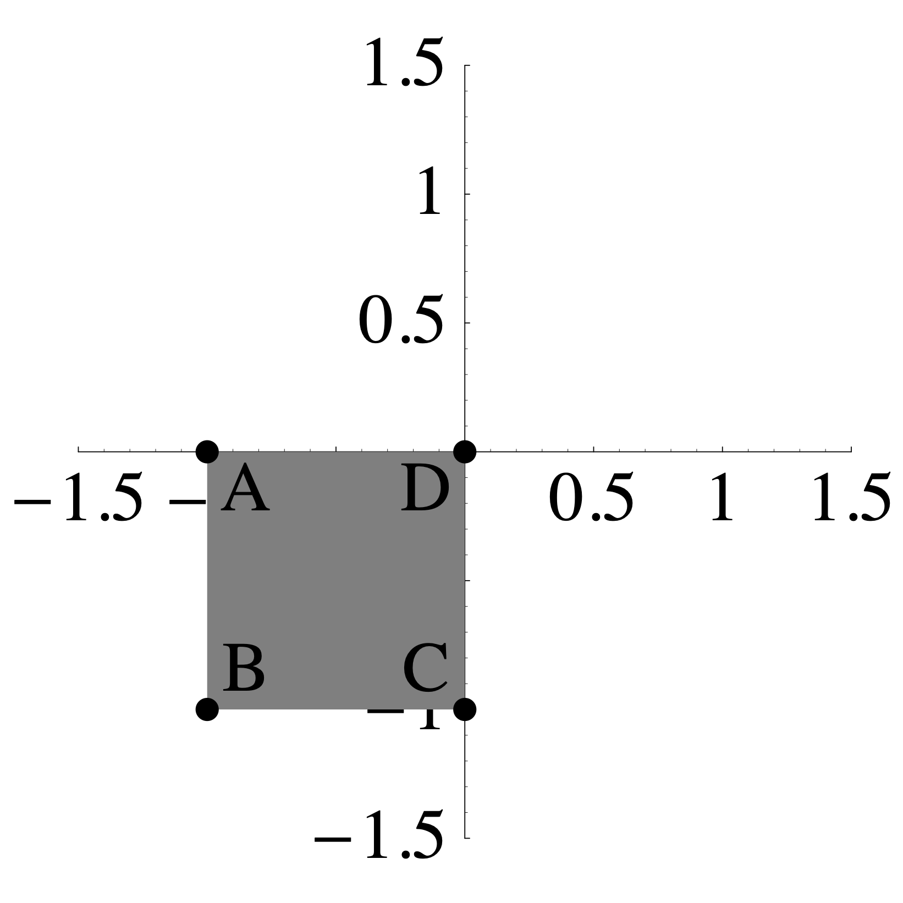

--- 
title: "MATH 236: Linear Algebra"
site: bookdown::bookdown_site
output:
  bookdown::gitbook:
    config:
      sharing:
        facebook: false
        twitter: false
documentclass: book
link-citations: yes
github-repo: Tom-Halverson/math236_f21
description: "This is the class activity manual for MATH 236 at Macalester College."
---


**Macalester College**    
**Fall 2021**

# Preface {-}


This is the class handbook for Math 236 Linear Algebra at Macalester College. The content here was made by [Andrew Beveridge](https://mathbeveridge.github.io) 
and [Tom Halverson](https://www.macalester.edu/~halverson/) and other faculty in the [Department  of Mathematics, Statistics and Computer Science](https://www.macalester.edu/mscs/) at [Macalester College](https://www.macalester.edu/).

<br>
<br>
<br>


This work is licensed under a [Creative Commons Attribution-NonCommercial-ShareAlike 4.0 International License](https://creativecommons.org/licenses/by-nc-sa/4.0/).

<!--chapter:end:index.Rmd-->

# (PART) Problem Sets {-}

# Problem Set 1

* Due: Friday September 10 by midnight CST. These will typically be due on Wednesday but this one is moved to Friday because we do not have class on Monday due to Labor Day.
* Upload your solutions to problems 1--4 by writing them out by hand, scanning them to pdf using a scanning software such as AdobeScan, assembling them into a single PDF, and uploading it to  Moodle. 
* Problem 1.5 is to be done using RStudio. To solve it, create an Rmarkdown file, knit it to .html, and upload the .html on Moodle along with the PDF for questions 1-4. *There will be time to work on this problem in class on May 23-24.*

## Characterize the Solution Set

The following augmented matrices are in row echelon form. Decide whether the set of solutions  is a point, line, plane, or the empty set in 3-space. Briefly justify your answer.

a.
$\left[
\begin{array}{ccc|c}
1 & 1 & -3 & 2 \\
0 & 0 & 0 & 0 \\
0 &  0 & 0 & 0 \\
\end{array}
\right]$

b.
$\left[
\begin{array}{ccc|c}
1 & 3 & -1 & 4 \\
0 & 1 & 4   & 0\\
0 &  0 & 0  & 1 \\
\end{array}
\right]$


c.
$\left[
\begin{array}{ccc|c}
1 & -1 & 0  & -2 \\
0 & 1 & 1  & 7\\
0 &  0 & 1 & 1\\
\end{array}
\right]$

d.
$\left[ 
\begin{array}{ccc|c}
1 & -1 & 0 & 6 \\
0 & 0 & 1 & -2 \\
0 &  0 & 0 & 0 \\
\end{array}
\right]$


## Find the General Solution

Each of the following matrices is the reduced row echelon form of the augmented matrix of a system of linear equations. Give the general solution to each system. 

a.
$\left[
\begin{array}{cccc|c}
1 & 3 & 0 & -2 & 5\\
0 & 0 & 1 & 4 & -2 \\
\end{array}
\right]$

b.
$\left[
\begin{array}{ccccc|c}
1 & 0 & 4 & 0 & 3 & 6\\
0 & 1 & 1 & 0 & -2& -8 \\
0 & 0 & 0 & 1 & -1 & 3 \\
\end{array}
\right]$

c.
$\left[
\begin{array}{cccc|c}
1 & 4 & 0 & 0 & -2 \\
0 & 0 & 1 & 7  & 6\\
0 & 0 & 0 & 0  & 0 \\
\end{array}
\right]$


## Elementary row operations are reversible 
In each case below, an elementary row operation turns the matrix $A$ into the  matrix $B$. For each of them,

* Describe the row operation that turns $A$ into $B$, and 
* Describe the row operation that turns $B$ into $A$. 

Give your answers in the form: "scale $R_2$ by 3" or "swap $R_1$  and $R_4$" or "replace $R_3$ with $R_3 + \frac{1}{5} R_1$."

a.
$$A=\left[
\begin{array}{cccc}
 1 & 1 & 1 & 3 \\
 1 & -2 & 2 & 1 \\
 2 & 8 & 2 & -4 \\
 3 & 1 & 6 & -1 \\
\end{array}
\right]\longrightarrow 
B=\left[
\begin{array}{cccc}
 1 & 1 & 1 & 3 \\
 1 & -2 & 2 & 1 \\
 2 & 8 & 2 & -4 \\
 0 & 7 & 0 & -4 \\
\end{array}
\right]$$

b.
$$A=\left[
\begin{array}{cccc}
 1 & 1 & 1 & 3 \\
 1 & -2 & 2 & 1 \\
 2 & 8 & 2 & -4 \\
 3 & 1 & 6 & -1 \\
\end{array}
\right]\longrightarrow 
B=\left[
\begin{array}{cccc}
1 & -2 & 2 & 1 \\
 1 & 1 & 1 & 3 \\
 2 & 8 & 2 & -4 \\
 3 & 1 & 6 & -1 \\
\end{array}
\right]$$

c.
$$A=\left[
\begin{array}{cccc}
 1 & 1 & 1 & 3 \\
 1 & -2 & 2 & 1 \\
 2 & 8 & 2 & -4 \\
 3 & 1 & 6 & -1 \\
\end{array}
\right]\longrightarrow 
B=\left[
\begin{array}{cccc}
 1 & 1 & 1 & 3 \\
 1 & -2 & 2 & 1 \\
 1 & 4 & 1 & -2 \\
 3 & 1 & 6 & -1 \\
\end{array}
\right]$$

## Designer Parabolas

In each part below, set up and solve a linear system of equations to find **all** possible parabolas of the form
$$
f(x) = a + b x + c x^2
$$ 
that satisfy the given conditions. For full credit, please solve these by hand, doing all row reductions that bring the system of equations to Reduced Row Echelon Form. On future assignments, you can solve problems like this using either RStudio or WolframAlpha. You are welcome (and, in fact, encouraged) to check your answers using software. 

a. $f(x)$ passes through the three points: $(1,3), (3,11),(2,4)$.

b. $f(x)$ passes through the three points: $(1,3), (3,11),(3,10)$.

c. $f(x)$ passes through the *two* points: $(1,3)$ and $(3,11)$.


## Traffic Flow

Below you find a section of one-way streets in downtown St Paul, where the arrows indicate traffic direction.  The traffic control center has installed electronic sensors that count the numbers of vehicles passing through the 6 streets that lead into and out of this area.  Assume that the total flow that enters each intersection equals the the total flow that leaves each intersection (we will ignore parking and staying). 


<center>

{width=50%}

</center>


a. Create a system of linear equations to find the possible flow values for the inner streets $x_1, x_2, x_3, x_4$.

b. Using RStudio, enter the augmented matrix of this system, and solve it using the rref command. Type out the general solution to this system of equations.  There will be time to do this **in class** on Wednesday. 

c. Your  answer to part b should be an infinite solution set. Give two distinct solutions that are realistic in terms of  **traffic flow**.

d. Is it possible to close down the street labeled by $x_2$ for road construction? That is, is it possible to have $x_2 = 0$ and to meet the other conditions?


<!--chapter:end:PS1-problem-set-1.Rmd-->


# Problem Set 2

* Due: **Friday** September 17 by 11:59PM CST. 
* Upload your solutions to Moodle in a PDF. 
* Please feel free to **use RStudio for all row reductions.**
* In problems where you use RStudio for row reduction and are not asked to turn in an R markdown file, you can write something like this:
<center>
{width=50%}
</center>

```{r setup, include=FALSE}
library(knitr)
opts_chunk$set(echo = FALSE,
               out.width = "75%", 
               fig.align = "center")
```

```{r, echo=FALSE}
require(pracma)
```

The Problem Set covers sections 1.3 (vector equations), 1.4 (matrix equations), and 1.5 (parametric solutions and the relationship between homogeneous and nonhomogeneous equations).

## Vector Equation

Decide if the vectors $\mathsf{b}$ and $\mathsf{d}$ are in the span of the vectors $\mathsf{v}_1$, $\mathsf{v}_2$, $\mathsf{v}_3$, $\mathsf{v}_4$. If the vector *is* in the span, then give a linear combination of the vectors that does it. If it is *not* in the span, demonstrate that it is not with an appropriate matrix computation.
$$
\mathsf{v}_1 = \begin{bmatrix} 2 \\ 2 \\ 1 \\ 1 \end{bmatrix},\quad
\mathsf{v}_2 = \begin{bmatrix} -1 \\ -1 \\ -1 \\ 3 \end{bmatrix},\quad
\mathsf{v}_3 = \begin{bmatrix} -4 \\ -4 \\ -3 \\ 5 \end{bmatrix},\quad
\mathsf{v}_4 = \begin{bmatrix} -1 \\ 2 \\ -2 \\ 1 \end{bmatrix}.
$$
$$
\mathsf{b} = \begin{bmatrix} 36 \\ 48 \\ 19 \\ -25 \end{bmatrix},\qquad
\mathsf{d} = \begin{bmatrix} 30 \\ 24 \\ 10 \\ 10 \end{bmatrix}.
$$
Here are the vectors for you:
```{r,echo=TRUE}
v1 = c(2,2,1,1)
v2 = c(-1,-1,-1,3)
v3 = c(-4,-4,-3,5)
v4 = c(-1,2,-2,1)
b = c(36,48,19,-25)
d = c(30,24,10,10)
```


## Matrix Equation

Solve the matrix equation, A x = b, below and give your answer in **parametric vector form** (we will disccuss parametric form on Monday Sept 13). Describe the solution set geometrically: e.g., "a line in $\mathbb{R}^4$" or "a plane in $\mathbb{R}^6$."
$$
\begin{bmatrix}
 1 & 1 & -1 & -1 & 2  \\
 1 & 0 & -2 & 1 & 1  \\
 -2 & 1 & 5 & 1 & -6  \\
 -3 & 0 & 6 & 2 & -8  \\
 0 & 1 & 1 & 2 & -3  \\
 1 & 0 & -2 & -1 & 3  \\
\end{bmatrix}
\begin{bmatrix} x_1 \\ x_2 \\ x_3 \\ x_4 \\ x_5 \end{bmatrix}
= 
\begin{bmatrix} 1 \\ 3 \\ 2\\ 1 \\ 6 \\ -1 \end{bmatrix}
$$
Here is the matrix A and the vector b for you:
```{r,echo=TRUE}
A = cbind(c(1,1,-2,-3,0,1),c(1,0,1,0,1,0),c(-1,-2,5,6,1,-2),c(-1,1,1,2,2,-1),c(2,1,-6,-8,-3,3))
b = c(1,3,2,1,6,-1)
```


## RREF for a linear system

Here is the reduced row echelon form of a matrix $\mathsf{A}$ (you are not given the matrix $\mathsf{A}$).
$$
\mathsf{A} \longrightarrow \left[
\begin{array}{cccc}
 1 & 0 & 0 & 5 & -2\\
 0 & 1 & 0 & -7 & 4\\
 0 & 0 & 1 & 2 & -3\\
0 & 0 & 0 & 0 & 0\\
\end{array}
\right]
$$

  a. Give the solution to the homogeneous matrix equation $A x = \mathbf{0}$ in  **parametric vector form** and describe the geometry of the solution. For example, you answer should be something like: "it is a plane in $\mathbb{R}^3$" or "it is a line in $\mathbb{R}^7$" or "it is a point in $\mathbb{R}^4$."
  
  c.  Suppose that we also know that $\mathsf{A}\begin{bmatrix} 4 \\ 1 \\ 3 \\ 2 \\ 1 \end{bmatrix} = \begin{bmatrix}  5 \\ 1 \\ 2 \\3  \end{bmatrix}$. Then give the general solution to 
$\mathsf{A} \mathsf{x}= \begin{bmatrix}  5 \\ 1 \\ 2  \\ 3 \end{bmatrix}$ in parametric form.


## A square matrix 

Suppose that $A$ is a $5\times 5$ matrix and $\mathsf{b}$ is a vector in $\mathbb{R}^5$ with the property that 
$A\mathsf{x}=\mathsf{b}$ has a unique solution. Explain why the columns of $A$ must span $\mathbb{R}^5$.  Use the reduced row echelon form of $A$ in your explanation.

## Combining solutions to $A \mathsf{x} = \mathsf{b}$

Suppose that $\mathsf{x}_1$ and $\mathsf{x}_2$ are solutions to $\mathsf{A} \mathsf{x} = \mathsf{b}$ (where $\mathsf{b} \not= \mathsf{0}$). 

a. Decide if any of the following are also solutions to $\mathsf{A} \mathsf{x} = \mathsf{b}$. Justify your answers.
    i. $\mathsf{x}_1+ \mathsf{x}_2$
    ii. $\mathsf{x}_1 - \mathsf{x}_2$
    iii. $\frac{1}{2} ( \mathsf{x}_1 + \mathsf{x}_2)$
    iv. $\frac{5}{2} \mathsf{x}_1 - \frac{3}{2} \mathsf{x}_2$.

b. Under what conditions on $c$ and $d$ is the linear combination $\mathsf{x} = c \mathsf{x}_1 + d \mathsf{x}_2$ a solution to $\mathsf{A} \mathsf{x} = \mathsf{b}$? Justify your answer.
c. Let $\mathsf{u}$ be the vector that *points to* $1/3$ of the way from the tip of $\mathsf{v}$ to the tip of $\mathsf{w}$ as depicted below. 
    i. Write $\mathsf{u}$ as a linear combination of $\mathsf{v}$ and $\mathsf{w}$ (hint: think about $\mathsf{w} - \mathsf{v}$)
    ii. If $\mathsf{v}$ and $\mathsf{w}$ are solutions to $A x = \mathsf{b}$ then show that $\mathsf{u}$ is also a solution to $A \mathsf{x} = \mathsf{b}$.

<center>
{width=30%}
</center>
<!--
\begin{tikzpicture}

\draw[-latex, very thick,green] (0,0) -- (2,8/3);
\draw[-latex, very thick,blue] (0,0) -- (1,3);
\draw[-latex, very thick,blue] (0,0) -- (4,2);
\draw[-latex, very thick,red] (1,3) -- (4,2);

\node at (1.55,1.75) {$\mathsf{u}$};
\node at (.3,1.75) {$\mathsf{v}$};
\node at (2.75,1) {$\mathsf{w}$};

\end{tikzpicture}
-->

## A Balanced Diet
  

An athlete wants to consume  a daily diet of 200 grams of carbohydrates, 60 grams of fats and 160 grams of  proteins. Here are some of their favorite foods.


```{r}
food.data <- data.frame(
   food = c ("almonds", "avocado",  "beans", "bread", "cheese", "chicken", "egg", "milk", "zucchini"),
   carbs = c(3,15,20,12,1,0,1,12,6),
   fats = c(8,31,1,1,5,13,5,8,0), 
   proteins = c(5,4,8,2,3,50,6,8,2)
)

knitr::kable(
  food.data, booktabs = TRUE,
  caption = 'Food Carb/Fat/Protein (grams)'
)
```


1. Explain why they **cannot** achieve their daily goal by eating only almonds, milk and zucchini.Use the word **span** in your answer.

2. Explain why they **cannot** achieve their daily goal by eating only almonds, beans and cheese.

3. Find a valid one-day diet consisting of almonds, chicken, and zucchini. 


<!--chapter:end:PS2-problem-set-2.Rmd-->


# Problem Set 3

* Due: **Wednesday** September 22 by midnight. 
     * Free Extension: anything turned in by 5PM Friday will be considered on time. 
     * After 5PM Friday, late assignments are subject to a 15% late penalty.
     * After I post the solution on Monday, there is a 50% late penalty.
* Upload your solutions to Moodle in a PDF. 
* Please feel free to **use RStudio for all row reductions.**
* You can download the [Rmd source file  for this problem set](https://github.com/Tom-Halverson/math236_f21/blob/main/PS3-problem-set-3.Rmd).

The Problem Set covers sections 1.7 Linear Independence and 1.8 Linear Transformations.

## RREF for a set of vectors

Suppose that we have five vectors 
$\mathsf{v}_1, \mathsf{v}_2,\mathsf{v}_3,\mathsf{v}_4,\mathsf{v}_5$ in $\mathbb{R}^4$ and that the matrix $A$ containing those vectors row reduces as follows
$$
A = \left[
\begin{array}{ccc}
\mid & \mid  & \mid & \mid & \mid \\
\mathsf{v}_1 & \mathsf{v}_2 & \mathsf{v}_3 &\mathsf{v}_4 &\mathsf{v}_5  \\
\mid & \mid  & \mid & \mid & \mid 
\end{array}
\right]
 \longrightarrow
\begin{bmatrix}
1 & 0 & -3 & 0 & 2  \\
0 & 1 & 4 & 0 &  1  \\
0 & 0 & 0 & 1 & 1  \\
0 & 0 & 0 & 0 & 0 
\end{bmatrix}.
$$


  a.  Do the vectors $\mathsf{v}_1, \mathsf{v}_2, \mathsf{v}_3, \mathsf{v}_4, \mathsf{v}_5$ span $\mathbb{R}^4$? Justify your answer.
  
  b. Give the solution, in parametric form, to the homogeneous system of equations $A x = 0$ for this problem.
  
  c. Give a dependence relation among the vectors $\mathsf{v_1}, \mathsf{v_2},\mathsf{v_3},\mathsf{v_4}, \mathsf{v_5}$.

  d. Is the vector $\mathsf{v}_3$  in $\mathrm{span}(\mathsf{v}_1,\mathsf{v}_2)$? Justify your answer.

  e. Suppose that $\mathsf{b} = 5 \mathsf{v}_1  + \mathsf{v}_2 - 3 \mathsf{v}_3 +4 \mathsf{v}_4 - \mathsf{v}_5$. Use what you have done above to write $\mathsf{b}$ as a different linear combination  of $\mathsf{v_1}, \mathsf{v_2},\mathsf{v_3},\mathsf{v_4}, \mathsf{v_5}$ (i.e., with different weights).


## Linear independence and unique expressions.

It is an important fact that if a set of vectors $\mathsf{v}_1, \mathsf{v}_2, \mathsf{v}_3, \ldots, \mathsf{v}_n$ is *linearly independent* then any vector in the span of these vectors can be written as a *unique* linear combination of those vectors. 

a. This property has a fairly simple proof. Let's suppose that n = 4 for simplicity and that a vector v can be written in two ways as a combination of those vectors:
$$
\begin{array}{ccccccc}
v &=& c_1 \mathsf{v}_1 &+&  c_2 \mathsf{v}_2 &+&  c_3 \mathsf{v}_3 &+&  c_4 \mathsf{v}_4 \\
&=& d_1 \mathsf{v}_1 &+&  d_2 \mathsf{v}_2 &+&  d_3 \mathsf{v}_3 &+&  d_4 \mathsf{v}_4
\end{array}
$$
Then use the definition of linear independence to prove that $c_1 = d_1$, $c_2 = d_2$, $c_3 = d_3$, and $c_4 = d_4$.


## Is the transformation linear?
There are three transformations below. If you believe that the transformation is linear, then show it is by showing that the three linear transformation rules apply for *arbitrary* vectors. If you believe that the transformation is not linear. Then show that one of the rules fails for *specific* vectors.

(a)
$$
T \left( \begin{bmatrix} x_1 \\ x_2 \\ x_3 \end{bmatrix} \right)
=
\begin{bmatrix} x_1 + x_2 + x_3 -1 \\ x_1 - x_2 + x_3 + 1  \end{bmatrix}
$$

(b)
$$
T \left( \begin{bmatrix} x_1 \\ x_2  \end{bmatrix} \right)
=
\begin{bmatrix} 3 x_1 - 5 x_2 \\ 2 x_1 + x_2 \\ 2 x_1 + 3 x_2 \end{bmatrix}
$$
(c)
$$
T \left( \begin{bmatrix} x_1 \\ x_2 \\ x_3 \end{bmatrix} \right)
=
\begin{bmatrix} x_1 + x_2^2 + x_3 \\ 2 x_2 + x_1 x_3 \\ 2 x_1 + 3 x_2 + x_3 \end{bmatrix}
$$

## Partial Information about a Linear Transformation

We are given that $T: \mathbb{R}^4 \rightarrow \mathbb{R}^3$ is a linear transformation such that: 
$$
T\left(\begin{bmatrix} 3 \\ ~2~ \\ 1 \\ 2 \end{bmatrix} \right)=\begin{bmatrix}  ~2~ \\ 3 \\ 6 \end{bmatrix}
\qquad\hbox{and}\qquad
T\left(\begin{bmatrix}~~2 \\ -1 \\ 0 \\ -1 \end{bmatrix} \right)=\begin{bmatrix} 2 \\ ~0~  \\ 1 \end{bmatrix}.
$$
Use this information to compute the value of $T$ below? 
$$T\left(\begin{bmatrix} 5 \\ 8 \\ ~3~ \\ 8 \end{bmatrix} \right) = \hskip5in$$
Hint: express the third input vector as a linear combination of the first two.

## Square, Wide, and Tall Matrices

In each question below, choose all of the answers that apply, and give a succinct explanation of how you know that it is true. 

1. [Wide] You are given a wide 5 x 8 matrix and you are studying the matrix equation $A x = b$. These problems are said to be **under constrained** because there are fewer equations (constraints) than variables. 
$$
A=\begin{bmatrix} 
\ \cdot & \cdot & \cdot & \cdot & \cdot & \cdot & \cdot & \cdot\ \\
\ \cdot & \cdot & \cdot & \cdot & \cdot & \cdot & \cdot & \cdot\ \\
\ \cdot & \cdot & \cdot & \cdot & \cdot & \cdot & \cdot & \cdot\ \\
\ \cdot & \cdot & \cdot & \cdot & \cdot & \cdot & \cdot & \cdot\ \\
\ \cdot & \cdot & \cdot & \cdot & \cdot & \cdot & \cdot & \cdot\ \\
\end{bmatrix}
$$

     (a) The vector that you are trying to get to is $b \in \mathbb{R}^m$ and the solution vectors are $x \in \mathbb{R}^n$. What are $m$ and $n$?
     (a) Decide which of the following statements are true and give a short and succinct justification of your answer using complete sentences and good punctuation. 
          i. The columns of $A$ must span $\mathbb{R}^m$.
          i. The columns of $A$ must be linearly dependent.
          i. There is a unique solution to $A x = 0$.
          i. If the columns span $\mathbb{R}^m$ then there is a unique solution to $A x = b$ for all $b$.

\

2. [Tall] You are given a wide 7 x 4 matrix and you are studying the matrix equation $A x = b$. These problems are said to be **over constrained** because there are more equations (constraints) than variables. 
$$
A=\begin{bmatrix} 
\ \cdot & \cdot & \cdot & \cdot \ \\
\ \cdot & \cdot & \cdot & \cdot \ \\
\ \cdot & \cdot & \cdot & \cdot \ \\
\ \cdot & \cdot & \cdot & \cdot \ \\
\ \cdot & \cdot & \cdot & \cdot \ \\
\ \cdot & \cdot & \cdot & \cdot \ \\
\ \cdot & \cdot & \cdot & \cdot \ \\
\end{bmatrix}
$$

     (a) The vector that you are trying to get to is $b \in \mathbb{R}^m$ and the solution vectors are $x \in \mathbb{R}^n$. What are $m$ and $n$?
     (a) Decide which of the following statements are true and give a short and succinct justification of your answer using complete sentences and good punctuation. 
          i. The columns of $A$ might span $\mathbb{R}^m$.
          i. The columns of $A$ must be linearly dependent.
          i. There is a unique solution to $A x = 0$.

\

3. [Square] You are given a square 6 x 6 matrix and you are studying the matrix equation $A x = b$.
$$
A=\begin{bmatrix} 
\ \cdot & \cdot & \cdot & \cdot & \cdot & \cdot\  \\
\ \cdot & \cdot & \cdot & \cdot & \cdot & \cdot\  \\
\ \cdot & \cdot & \cdot & \cdot & \cdot & \cdot\  \\
\ \cdot & \cdot & \cdot & \cdot & \cdot & \cdot\  \\
\ \cdot & \cdot & \cdot & \cdot & \cdot & \cdot\ \\
\ \cdot & \cdot & \cdot & \cdot & \cdot & \cdot\ \\
\end{bmatrix}
$$

     (a) The vector that you are trying to get to is $b \in \mathbb{R}^m$ and the solution vectors are $x \in \mathbb{R}^n$. What are $m$ and $n$?
     (a) Decide which of the following statements are true and give a short and succinct justification of your answer using complete sentences and good punctuation. 
          i. The columns of $A$ must span $\mathbb{R}^m$.
          iii. If the columns span $\mathbb{R}^m$ then there is a unique solution to $A x = b$ for all $b$.
          iv. If ${\bf 0}$ is the only solution to $A x = {\bf 0}$, then there is a unique solution to $A x = b$ for all $b \in \mathbb{R}^m$.
          v. The columns of $A$ span $\mathbb{R}^m$ if and only if the columns of $A$ are linearly independent.


<!--chapter:end:PS3-problem-set-3.Rmd-->


# Problem Set 4

* Due: Wednesday September 29 by midnight CST. 
* Upload your solutions to Moodle in a PDF. 
* Please feel free to **use RStudio for all row reductions.**
* You can download the [Rmd source file  for this problem set](https://github.com/Tom-Halverson/math236_f21/blob/main/PS4-problem-set-4.Rmd).

 
=======

>>>>>>> 8fc3c6c399298042bc58de2aeea8eb3ed79f757c
The Problem Set covers sections  1.9. The Matrix of a Linear Transformation and One-to-One and Onto, 2.1. Matrix Multiplication, and 2.2 Matrix Inverses.

```{r}
require('pracma')
```

## Matrix of a Linear Transformation

In each example below, find the matrix of the given linear transformation (all of these transformations are linear). Do this by finding where the transformation sends the standard basis vectors $\mathsf{e}_1,\mathsf{e}_2,\mathsf{e}_3, \ldots$.

In each case below, if the transformation is linear, then find is matrix.
If it is not linear, then demonstrate that it is not linear by showing, with a specific example, that one of the properties of being linear is broken.  

a. The transformation $T$ is given by:
$$T \left( \begin{bmatrix}  x_1 \\ x_2 \\ x_3 \end{bmatrix}\right) =
\begin{bmatrix} x_3 \\ x_1 \\ x_2 \\\end{bmatrix}.
$$

b. The transformation $T$ is given by:
$$T \left( \begin{bmatrix}  x_1 \\ x_2 \\ x_3 \end{bmatrix} \right)= 
  \begin{bmatrix} x_1 \\ x_1 + x_2  \\ x_2 + x_3 \end{bmatrix} + 
  \begin{bmatrix} x_3 \\ x_3 \\ x_1 \\\end{bmatrix}
$$

c. The transformation $L: \mathbb{R}^2 \to \mathbb{R}^2$ sends the shaded region on the  left to the the shaded region on the right such that $A$ maps to $A$, $B$ maps to $B$, $C$ maps to $C$, and $D$ maps to $D$.

{width=30%} $\qquad \qquad$ {width=30%} 

d. The transformation $R: \mathbb{R}^2 \to \mathbb{R}^2$ sends the shaded region on the  left to the the shaded region on the right such that $A$ maps to $A$, $B$ maps to $B$, $C$ maps to $C$, and $D$ maps to $D$.

{width=30%} $\qquad \qquad$ {width=30%}
<<<<<<< HEAD

e. Below are two linear transformations $T: \mathbb{R}^2 \to \mathbb{R}^2$ that transform my house as shown. Find the matrix of each of these transformations (hint: use the base, the doorway and the peak of the roof as a guide).


{width=40%} $\qquad \qquad$ {width=40%}


## Matrix of a Nonlinear Transformation?

=======

e. Below are two linear transformations $T: \mathbb{R}^2 \to \mathbb{R}^2$ that transform my house as shown. Find the matrix of each of these transformations (hint: use the base, the doorway and the peak of the roof as a guide).


{width=40%} $\qquad \qquad$ {width=40%}


## Matrix of a Nonlinear Transformation?

>>>>>>> 8fc3c6c399298042bc58de2aeea8eb3ed79f757c
This problem illustrates what happens if you try to make the matrix of a transformation that is not linear. Consider the transformation $T$ defined by
$$
T \left( \begin{bmatrix} x_1 \\ x_2 \\ x_3 \end{bmatrix} \right)
=
\begin{bmatrix} x_1 + x_2^2 + x_3 \\ 2 x_2 + x_1 x_3 + 1 \\ 2 x_1 + 3 x_2 + x_3 \end{bmatrix}
$$
a. Show that this is not a linear transformation by demonstrating, with a specific example, that one of the rules of being linear is not true.

b. Now. let's see what happens if we compute its matrix anyway. Compute $T(\mathbf{e}_1)$, $T(\mathbf{e}_2)$, and $T(\mathbf{e}_3)$, and put the vectors you get in the columns of a matrix $A$. Then compute the product below:
$$
\underbrace{\begin{bmatrix} 
\cdot & \cdot & \cdot \\
\cdot & \cdot & \cdot \\
\cdot & \cdot & \cdot \\
\end{bmatrix}}_{A}
\begin{bmatrix} x_1 \\ x_ 2 \\ x_3 \end{bmatrix}
= 
$$
Explain how the result of this computation demonstrates that $T$ is not linear.


## Inner and Outer Products

I hope to give you some time to discuss this in class on Friday Sep 24.

We can also think of vectors as matrix. A column vector is an $n \times 1$ matrix and a row vector is a $1 \times n$ matrix. 

a. Compute the following products. These matrix products are called *inner products* (or dot products) of the vectors.


$$
\begin{bmatrix} 4 & -1 & 2 & 3\end{bmatrix}
\begin{bmatrix} 1 \\ 2 \\1  \\3  \\\end{bmatrix} = \hskip3in
$$
$$
\begin{bmatrix} 4 & -1 & 2 & 3\end{bmatrix}
\begin{bmatrix} 1 \\ 1 \\1  \\1  \\\end{bmatrix} = \hskip3in
$$
$$
\begin{bmatrix} 4 & -1 & 2 & 3\end{bmatrix}
\begin{bmatrix} 2 \\ 5 \\ 0  \\ -1  \\\end{bmatrix} = \hskip3in
$$
b. Now compute the following products. These are called *outer products*.  

$$
\begin{bmatrix} 1 \\ 2 \\1  \\3  \\\end{bmatrix}
\begin{bmatrix} 1 & -5 & 2 & 3\end{bmatrix} = \hskip3in
$$
<<<<<<< HEAD

$$
\begin{bmatrix} 1 \\ 2 \\1  \\3  \\\end{bmatrix}
\begin{bmatrix} 1 & 1 & 1 & 1\end{bmatrix} =\hskip3in
$$

c. Row reduce both of the matrices that you get in part b (this should be easy to do by hand,but you can use R if you want to). How many pivots do you get? Explain why you always get this number of pivots when you row reduce an outer product.

=======

$$
\begin{bmatrix} 1 \\ 2 \\1  \\3  \\\end{bmatrix}
\begin{bmatrix} 1 & 1 & 1 & 1\end{bmatrix} =\hskip3in
$$

c. Row reduce both of the matrices that you get in part b (this should be easy to do by hand,but you can use R if you want to). How many pivots do you get? Explain why you always get this number of pivots when you row reduce an outer product.
>>>>>>> 8fc3c6c399298042bc58de2aeea8eb3ed79f757c

## Archaeological Seriation

<<<<<<< HEAD
There may be time to discuss this in class on Friday Sep 24.


The matrix $A$ below is used in  archaeological dating. Its rows correspond to four different grave sites $G_1, G_2, G_3, G_4$ and its columns correspond to five types of pottery$P_1, P_2, P_3, P_4, P_5$. There is a 1 in position $i$-$j$ if pottery type $P_j$ is found in grave $G_i$ (and a 0 otherwise).
$$
A=\begin{array}{c|ccccc}
& P_1 & P_2 & P_3 & P_4 & P_5 \\
\hline
 G_1 & 1 & 1 & 0 & 1 & 1 \\
G_2 &  0 & 0 & 1 & 0 & 1 \\
G_3 &  0 & 1 & 1 & 0 & 1 \\
G_4  & 1 & 1 & 1 & 1 & 1 \\
\end{array}
$$

1. Compute the matrix $\mathbf{G} = A A^T$, where $A^T$ is the *transpose* of $A$, meaning that the rows and columns have been interchanged.
=======
## Archaeological Seriation

There may be time to discuss this in class on Friday Sep 24.
>>>>>>> 8fc3c6c399298042bc58de2aeea8eb3ed79f757c

2. Give the meaning of the $i$-$j$ entry of $\mathbf{G}$ (the entry in row $i$ and column $j$). State clearly the meaning of this entry using complete sentences (or sentence) and explain why it has this meaning.

<<<<<<< HEAD
## Rental Car

I hope to give you some time to work on this in class on Friday Sep 24.


Solve this problem using R and turn in a markdown file knitted to .html. 

A group of Macalester alumni open a rental car company specializing in  renting electric cars. As a start, they have opened offices in St. Paul, Rochester, and Duluth. Through market research they find that of the cars rented in St. Paul, 85% will get returned in St. Paul, 9% will get returned in Rochester, and 6% will get returned in Duluth. Of the cars rented in Rochester, 30% will get returned in St. Paul, 60% will get returned in Rochester, and 10% in Duluth. Of the cars rented in Duluth, 35% will get returned in St. Paul, 5% in Rochester, and 60% in Duluth. This information is represented in the matrix below.
=======
The matrix $A$ below is used in  archaeological dating. Its rows correspond to four different grave sites $G_1, G_2, G_3, G_4$ and its columns correspond to five types of pottery$P_1, P_2, P_3, P_4, P_5$. There is a 1 in position $i$-$j$ if pottery type $P_j$ is found in grave $G_i$ (and a 0 otherwise).
$$
A=\begin{array}{c|ccccc}
& P_1 & P_2 & P_3 & P_4 & P_5 \\
\hline
 G_1 & 1 & 1 & 0 & 1 & 1 \\
G_2 &  0 & 0 & 1 & 0 & 1 \\
G_3 &  0 & 1 & 1 & 0 & 1 \\
G_4  & 1 & 1 & 1 & 1 & 1 \\
\end{array}
$$

1. Compute the matrix $\mathbf{G} = A A^T$, where $A^T$ is the *transpose* of $A$, meaning that the rows and columns have been interchanged.

2. Give the meaning of the $i$-$j$ entry of $\mathbf{G}$ (the entry in row $i$ and column $j$). State clearly the meaning of this entry using complete sentences (or sentence) and explain why it has this meaning.

## Rental Car

I hope to give you some time to work on this in class on Friday Sep 24.
>>>>>>> 8fc3c6c399298042bc58de2aeea8eb3ed79f757c

```{r,echo=TRUE}
StP = c(.85,.09,.06)
Roch = c(.30,.60,.10)
Dul = c(.35,.05,.60) 
M = cbind(StP,Roch,Dul)
M
```
Such a matrix is called a *probability* matrix or a *stochastic* matrix because it  contains numbers between 0 and 1 and each of its columns sum to 1.

<<<<<<< HEAD
a. The owners are trying to use this data to estimate how much of their fleet will be at each location on average in the long run. Assume that initially they locate 20 cars in each city. This can be recorded by the vector `v0 = c(20,20,20)`. Apply, M to v0, call this vector v1, and explain, using how the matrix-vector product works, why v1 represents the number of cars at each location one day later (for simplicity, we assume that each rental is for 1 day).

b. Now apply M to v1 and call it v2. This should represent the number of cars at each location 2 days later. Also compute the square of the matrix M and call it M2. Confirm that M2 times v0 is the same as M times v1. 

c. Write a for loop that applies M over and over again to see what happens to the distribution of cars in the long-run (we will learn how to do this in class but you can also probably just google it). Does this sequence stabilize or does it keep changing after each application? If it does stabilize, how long does it take to stabilize (to within 0.1 cars at each location).

d. Does the starting distribution matter? Try 4 different starting distributions (with a total of 60 cars) and see what the final distribution looks like in each case. For one of your 4 starting distributions, try all 60 cars at one of the locations.
=======
Solve this problem using R and turn in a markdown file knitted to .html. 

A group of Macalester alumni open a rental car company specializing in  renting electric cars. As a start, they have opened offices in St. Paul, Rochester, and Duluth. Through market research they find that of the cars rented in St. Paul, 85% will get returned in St. Paul, 9% will get returned in Rochester, and 6% will get returned in Duluth. Of the cars rented in Rochester, 30% will get returned in St. Paul, 60% will get returned in Rochester, and 10% in Duluth. Of the cars rented in Duluth, 35% will get returned in St. Paul, 5% in Rochester, and 60% in Duluth. This information is represented in the matrix below.

```{r,echo=TRUE}
StP = c(.85,.09,.06)
Roch = c(.30,.60,.10)
Dul = c(.35,.05,.60) 
M = cbind(StP,Roch,Dul)
M
```
Such a matrix is called a *probability* matrix or a *stochastic* matrix because it  contains numbers between 0 and 1 and each of its columns sum to 1.

a. The owners are trying to use this data to estimate how much of their fleet will be at each location on average in the long run. Assume that initially they locate 20 cars in each city. This can be recorded by the vector `v0 = c(20,20,20)`. Apply, M to v0, call this vector v1, and explain, using how the matrix-vector product works, why v1 represents the number of cars at each location one day later (for simplicity, we assume that each rental is for 1 day).
>>>>>>> 8fc3c6c399298042bc58de2aeea8eb3ed79f757c

b. Now apply M to v1 and call it v2. This should represent the number of cars at each location 2 days later. Also compute the square of the matrix M and call it M2. Confirm that M2 times v0 is the same as M times v1. 

<<<<<<< HEAD
## Rainy Day in LA

I hope to give you some time to discuss this in class on Monday Sep 24.


In Los Angeles if it rains today, there is a 50% chance it will rain tomorrow, but it if is sunny today, there is a 90% chance it will be sunny tomorrow. This is modeled in the rain-sunshine probability matrix P. 
$$
P = 
\begin{array}{c|cc|}
&\text{rain}&\text{sun}\\
\hline
\text{rain}&1/2&1/10\\
\text{sun}&1/2&9/10\\
\hline
\end{array}
$$
This matrix works as follows: if the rain-sunshine probability today is (40, 60) (that is, 40% chance rain and 60% chance sunshine), then the rain-sunshine probability tomorrow is (26, 74) as seen by the calculation below.
$$
\begin{bmatrix}
1/2 & 1/10 \\
1/2 & 9/10 \\
\end{bmatrix} \begin{bmatrix} 40 \\ 60 \end{bmatrix} = \begin{bmatrix} 26 \\ 74 \end{bmatrix}
$$

=======
c. Write a for loop that applies M over and over again to see what happens to the distribution of cars in the long-run (we will learn how to do this in class but you can also probably just google it). Does this sequence stabilize or does it keep changing after each application? If it does stabilize, how long does it take to stabilize (to within 0.1 cars at each location).

d. Does the starting distribution matter? Try 4 different starting distributions (with a total of 60 cars) and see what the final distribution looks like in each case. For one of your 4 starting distributions, try all 60 cars at one of the locations.


## Rainy Day in LA

I hope to give you some time to discuss this in class on Monday Sep 24.


In Los Angeles if it rains today, there is a 50% chance it will rain tomorrow, but it if is sunny today, there is a 90% chance it will be sunny tomorrow. This is modeled in the rain-sunshine probability matrix P. 
$$
P = 
\begin{array}{c|cc|}
&\text{rain}&\text{sun}\\
\hline
\text{rain}&1/2&1/10\\
\text{sun}&1/2&9/10\\
\hline
\end{array}
$$
This matrix works as follows: if the rain-sunshine probability today is (40, 60) (that is, 40% chance rain and 60% chance sunshine), then the rain-sunshine probability tomorrow is (26, 74) as seen by the calculation below.
$$
\begin{bmatrix}
1/2 & 1/10 \\
1/2 & 9/10 \\
\end{bmatrix} \begin{bmatrix} 40 \\ 60 \end{bmatrix} = \begin{bmatrix} 26 \\ 74 \end{bmatrix}
$$

>>>>>>> 8fc3c6c399298042bc58de2aeea8eb3ed79f757c
a. Find the rain-sunshine probability the day after tomorrow.

b. Compute $P^2$ and explain the meaning of each of the four entries in the matrix.

c. Find $P^{-1}$ and   and use it find the rain-sunshine probability *yesterday* if the rain-sunshine probability today is (40, 60).


<!--chapter:end:PS4-problem-set-4.Rmd-->

# (PART) Concepts of Linear Algebra  {-}

\newcommand{\v}{\mathsf{v}}

# Important Definitions

## Systems of Equations

Row operations

: The elementary row operations are
1) **swap** two rows
2) **scale** a row by a nonzero scalar
3) **replace** a row by the sum of that row plus a scalar multiple of another row

Linear combination 

: A linear combination of a set of vectors $\v_1, \v_2, \ldots, \v_n$ is a sum of the form
$$
x_1 \v_1 + x_2 \v_2 + \cdots + x_n \v_n
$$
where the weights $x_1, x_2, \ldots, x_n$ are real numbers.

Span

: The span of a set of vectors $\v_1, \v_2, \ldots, \v_n$ is the set of *all possible* linear combinations of those vectors, so
$$
span(\v_1, \v_2, \ldots, \v_n) = \{ x_1 \v_1 + x_2 \v_2 + \cdots + x_n \v_n \mid
x_1, x_2, \ldots, x_n \in \mathbb{R}\},
$$

linear independence
: A set of vectors $\mathsf{v}_1, \mathsf{v}_2,\ldots, \mathsf{v}_n$ are
**linearly independent** if the only way to write  
$$ 
\mathsf{0} = c_1 \mathsf{v}_1 + c_2 \mathsf{v}_2 + \cdots + c_n \mathsf{v}_n 
$$ 
is with $c_1 = c_2 = \cdots = c_n = 0$.  

*Connection to Matrices:* If $A = [\mathsf{v}_1 \mathsf{v}_2 \cdots
\mathsf{v}_n]$ is the matrix with these vectors in the columns, then this is the
same as saying that $A x = \mathsf{0}$ has only the trivial solution. This is true if and only if $A$ has a **pivot in every column** so that there are no free variables. 

linear dependence
: Conversely, a set of vectors $\mathsf{v}_1, \mathsf{v}_2, \ldots,
\mathsf{v}_n$ are **linearly dependent** if there exist scalars $c_1,
c_2,\ldots, c_n \in \mathbb{R}$ that are **not all equal to 0** such that
$$ 
\mathsf{0} = c_1 \mathsf{v}_1 + c_2 \mathsf{v}_2 + \cdots + c_n
\mathsf{v}_n 
$$ 
This is called a **dependence relation** among
the vectors.  

*Connection to Matrices:* If $A =
[\mathsf{v}_1 \mathsf{v}_2 \cdots \mathsf{v}_n]$ is the matrix with these
vectors in the columns, then this is the same as saying that $\mathsf{x} = [c_1,
c_2, \ldots, c_n]^{\top}$ is a nontrivial solution to $A \mathsf{x} =
\mathsf{0}$.

## Linear Transformations

linear transformation
: A function $T: \mathbb{R}^n \to \mathbb{R}^m$ is a **linear transformation** if the following three properties hold:

     a. $T({\bf 0}) = {\bf 0}$.
     b. $T(\mathsf{u} + \mathsf{v}) = T(\mathsf{u}) + T(\mathsf{v})$ for all vectors $\mathsf{u},\mathsf{v} \in \mathbb{R}^n$.
     c. $T(c \mathsf{u}) = c T(\mathsf{u})$ for all vectors $\mathsf{v} \in \mathbb{R}^n$ and all scalars $c \in \mathbb{R}$.
     
These properties say that $T$ sends 0 to 0 and is preserves addition and scalar multiplication.


<!-- ## Vector Spaces -->

<!-- span  -->

<!-- : A set of vectors $\mathsf{v}_1, \mathsf{v}_2, \ldots, \mathsf{v}_n$ **span** a vector space $V$ if for every $\mathsf{v} \in V$ there exist a set of scalars (weights) $c_1, c_2, \ldots, c_n \in \mathbb{R}$ such that  -->
<!-- $$ -->
<!-- \mathsf{v} = c_1 \mathsf{v}_1 + c_2 \mathsf{v}_2 + \cdots + c_n \mathsf{v}_n. -->
<!-- $$ -->
<!-- *Connection to Matrices:* If $A = [\mathsf{v}_1 \mathsf{v}_2 \cdots \mathsf{v}_n]$ is the matrix with these vectors in the columns, then this is the same as saying that $\mathsf{x} = [c_1, \ldots, c_n]^{\top}$ is a solution to $A x  = \mathsf{v}$. -->

<!-- linear independence -->

<!-- : A set of vectors $\mathsf{v}_1, \mathsf{v}_2,\ldots, \mathsf{v}_n$ are **linearly independent** if the only way to write  -->
<!-- $$ -->
<!-- \mathsf{0} = c_1 \mathsf{v}_1 + c_2 \mathsf{v}_2 + \cdots + c_n \mathsf{v}_n -->
<!-- $$ -->
<!-- is with $c_1 = c_2 = \cdots = c_n = 0$.  -->
<!-- <br/> -->
<!-- *Connection to Matrices:* If $A = [\mathsf{v}_1 \mathsf{v}_2 \cdots \mathsf{v}_n]$ is the matrix with these vectors in the columns, then this is the same as saying that $A x = \mathsf{0}$ has only the trivial solution. -->


<!-- linear dependence -->

<!-- : Conversely, a set of vectors $\mathsf{v}_1, \mathsf{v}_2, \ldots, \mathsf{v}_n$ are **linearly dependent** if there exist scalars $c_1, c_2,\ldots, c_n \in \mathbb{R}$ that are **not all equal to 0** such that -->
<!-- $$ -->
<!-- \mathsf{0} = c_1 \mathsf{v}_1 + c_2 \mathsf{v}_2 + \cdots + c_n \mathsf{v}_n -->
<!-- $$ -->
<!-- This is called a **dependence relation** among the vectors.  -->
<!-- <br/> -->
<!-- *Connection to Matrices:* If $A = [\mathsf{v}_1 \mathsf{v}_2 \cdots \mathsf{v}_n]$ is the matrix with these vectors in the columns, then this is the same as saying that $\mathsf{x} = [c_1, c_2, \ldots, c_n]^{\top}$ is a nontrivial solution to $A \mathsf{x} = \mathsf{0}$. -->


<!-- linear transformation -->

<!-- : A function $T: \mathbb{R}^n \to \mathbb{R}^m$ is a **linear transformation** when:  -->

<!--     * $T(\mathsf{u} + \mathsf{v}) = T(\mathsf{u}) + T(\mathsf{v})$ for all $\mathsf{u}, \mathsf{v} \in \mathbb{R}^n$ (preserves addition) -->
<!--     * $T(c \mathsf{u} ) = c T(\mathsf{u})$ for all $\mathsf{u} \in \mathbb{R}^n$ and $c \in \mathbb{R}$  (preserves scalar multiplication). -->
<!-- It follows from these that also $T(\mathsf{0}) = \mathsf{0}$. -->

<!-- one-to-one  -->

<!-- : A function $T: \mathbb{R}^n \to \mathbb{R}^m$ is a **one-to-one** when: -->

<!-- <center> -->
<!-- for all $\mathsf{y} \in \mathbb{R}^m$ there is **at most** one $\mathsf{x} \in \mathbb{R}^n$ such that $T(\mathsf{x}) = \mathsf{y}$. -->
<!-- </center> -->

<!-- onto  -->

<!-- : A function $T: \mathbb{R}^n \to \mathbb{R}^m$ is a **onto** when: -->

<!-- <center> -->
<!-- for all $\mathsf{y} \in \mathbb{R}^m$ there is **at least** one $\mathsf{x} \in \mathbb{R}^n$ such that $T(\mathsf{x}) = \mathsf{y}$. -->
<!-- </center> -->

<!-- subspace -->

<!-- : A subset $S \subseteq \mathbb{R}^n$ is a **subspace** when: -->

<!--     * $\mathsf{u} + \mathsf{v}  \in S$ for all $\mathsf{u}, \mathsf{v} \in S$ (closed under addition) -->
<!--     * $c \mathsf{u} \in S$ for all $\mathsf{u}\in S$ and $c \in \mathbb{R}$ (closed under scalar multiplication) -->
<!-- It follows from these that also $\mathsf{0} \in S$. -->


<!-- basis -->

<!-- : A **basis** of a vector space (or subspace) $V$ is a set of vectors $\mathcal{B} = \{\mathsf{v}_1, \mathsf{v}_2, \ldots, \mathsf{v}_n\}$  in $V$ such that -->

<!--     * $\mathsf{v}_1, \mathsf{v}_2, \ldots, \mathsf{v}_n$ span $V$ -->
<!--     * $\mathsf{v}_1, \mathsf{v}_2, \ldots, \mathsf{v}_n$ are linearly independent -->
<!-- Equivalently, one can say that $\mathcal{B} = \{\mathsf{v}_1, \mathsf{v}_2, \ldots, \mathsf{v}_n\}$ is a basis of $V$ if for every vector $\mathsf{v} \in V$ there is a **unique** set of scalars $c_1, \ldots, c_n$ such that -->
<!-- $$ -->
<!-- \mathsf{v} = c_1 \mathsf{v}_1 + c_2 \mathsf{v}_2 + \cdots + c_n \mathsf{v}_n. -->
<!-- $$ -->
<!-- (The fact that there is a set of vectors comes from the span; the fact that they are unique comes from linear independence). -->

<!-- dimension -->

<!-- : The **dimension** of a subspace $W$ is the number of vectors in any basis of $W$. This is also the fewest number of vectors required to span the subspace. -->


<!-- ## Matrices -->


<!-- invertible -->

<!-- : The square $n \times n$ matrix $A$ is **invertible** when there exists an $n \times n$ matrix $A^{-1}$ such that $A A^{-1} = I = A^{-1} A$. The Invertible Matrix Theorem collects over two dozen equivalent conditions, each of which guarantees that $A$ is invertible. -->

<!-- null space -->

<!-- : The **null space** $\mbox{Nul}(A) \subset \mathbb{R}^n$ of the $m \times n$ matrix $A$ is the set of solutions to the homogeneous equation $A \mathsf{x} = \mathbf{0}$> We also write this as -->
<!-- $$ -->
<!-- \mbox{Nul}(A) = \{ \mathsf{x} \in \mathbb{R}^n : A \mathsf{x} = \mathbf{0} \} -->
<!-- $$ -->
<!-- *Connection to Linear Transformations*: If $T(\mathsf{x}) = A \mathsf{x}$, then the kernel of $T$ is the null space of matrix $A$.  -->


<!-- column space -->

<!-- : The **column space** $\mbox{Col}(A) \subset \mathbb{R}^m$ of the $m \times n$ matrix $A$ is the set of all linear combinations of the columns of $A$.  -->
<!-- For $A = \begin{bmatrix} \mathsf{a}_1 & \mathsf{a}_2 & \cdots & \mathsf{a}_n \end{bmatrix}$, we have -->
<!-- $$ -->
<!-- \mbox{Col}(A) = \mbox{span} ( \mathsf{a}_1, \mathsf{a}_2, \ldots , \mathsf{a}_n ) -->
<!-- $$ -->
<!-- We also write this as -->
<!-- $$ -->
<!-- \mbox{Col}(A) = \{ \mathsf{b} \in \mathbb{R}^m : \mathsf{b} = A \mathsf{x} \mbox{ for some } \mathsf{x} \in \mathbb{R}^n \}. -->
<!-- $$ -->
<!-- *Connection to Linear Transformations*: If $T(\mathsf{x}) = A \mathsf{x}$, then the range (also called the image) of $T$ is the column space of matrix $A$.  -->


<!-- rank -->

<!-- : The **rank** of the $m \times n$ matrix $A$ is the dimension of the column space of $A$. This is also the number of pivot columns of the matrix. -->

<!-- eigenvalue and eigenvector -->

<!-- : For a square $n \times n$ matrix $A$, the scalar $\lambda \in \mathbb{R}$ is an **eigenvalue** for $A$ when there exists a nonzero vector  $\mathsf{x} \in \mathbb{R}^n$ such that $A \mathsf{x} = \lambda \mathsf{x}$. The nonzero vector $\mathsf{x}$ is the **eigenvector** for eigenvalue $\lambda$. The collection of all of these eigenvalues and eigenvectors is called the **eigensystem** of A. -->


<!-- diagonalization -->

<!-- : A square $n \times n$ matrix is **diagonalizable** when $A = P D P^{-1}$ where $D$ is a diagonal matrix and $P$ is an invertible matrix.  In this case, the eigenvalues of $A$ are the diagonal entries of $D$ and their corresponding eigenvectors are the columns of $P$. -->

<!-- dominant eigenvalue -->

<!-- : The eigenvalue $\lambda$ of  the square matrix $A$ is the **dominant eigenvalue** when  $| \lambda | > | \mu |$ where $\mu$ is any other eigenvalue of $A$. The dominant eigenvalue determines the long-term behavior of $A^t$ as $t \rightarrow \infty$. -->

<!-- ## Orthogonality -->

<!-- length  -->

<!-- : The **length** of a vector $\mathsf{v}$ is  -->
<!-- $$ -->
<!-- \| \mathsf{v} \| = \sqrt{v_1^2 + v_2^2 + \cdots + v_n^2}. -->
<!-- $$ -->

<!-- distance and angle -->

<!-- : The **distance** between vectors $\mathsf{u}$ and $\mathsf{v}$ is -->
<!-- $$ -->
<!-- \mbox{dist}(\mathsf{u},\mathsf{v}) = \| \mathsf{u} - \mathsf{v} \|. -->
<!-- $$ -->
<!-- The **angle** $\theta$ between these vectors is determined by -->
<!-- $$ -->
<!-- \cos \theta = \frac{\mathsf{u} \cdot \mathsf{v}}{ \| \mathsf{u} \| \, \| \mathsf{v} \|}. -->
<!-- $$ -->

<!-- orthogonal -->

<!-- : The vectors $\mathsf{u}$ and $\mathsf{v}$ are **orthogonal** when $\mathsf{u} \cdot \mathsf{v} = 0$. This means that either one of them is the zero vector, or they are perpendicular to one another. -->

<!-- orthogonal complement -->

<!-- : If $W \subset \mathbb{R}^n$ is a subspace, then its **orthogonal complement** $W^{\perp}$ is the set of all vectors in $\mathsf{R}^n$ that are orthogonal to $W$. We also write -->
<!-- $$ -->
<!-- W^{\perp} = \{ \mathsf{v} \in \mathbb{R}^n : \mathsf{v} \cdot \mathsf{w} \mbox{ for all } \mathsf{w} \in W \}. -->
<!-- $$ -->

<!-- orthonormal set -->

<!-- : A collection of vectors $\mathsf{u}_1, \mathsf{u}_2, \ldots, \mathsf{u}_k$ are an **orthonormal set** when every vector has length 1 and the vectors are pairwise orthogonal. -->
<!-- orthogonal matrix -->

<!-- orthogonal matrix -->

<!-- : A square $n \times n$ matrix $P$ is an **orthogonal matrix** when its columns are an orthonormal set. As a result, we have $P^{-1} = P^{\top}$. -->

<!-- projection and residual -->

<!-- : The **orthogonal projection**  of vector $\mathsf{y}$ into a subspace $W$ is the unique vector $\hat{\mathsf{y}} \in W$ such that $\mathsf{z} = \mathsf{y} - \hat{\mathsf{y}} \in W^{\perp}$. The vector $\mathsf{z}$ is called the **residual vector** for the projection. -->


<!-- ## Spectral Decompostion -->

<!-- orthogonal diagonalization -->

<!-- : Every symmetric $n \times n$ matrix is **orthogonally diagonalizable**, meaning that we have $A = P D P^{\top}$ where $D$ is a diagonal matrix and $P$ is an orthogonal matrix. The diagonal entries of $D$ are the eigenvalues of $A$ and the columns of $P$ are the corresponding orthonormal eigenvectors. Furthermore, the eigenvalues of $A$ are nonnegative. -->

<!-- spectral decomposition -->

<!-- : A symmetric matrix $A$ can be written as a linear combination of rank 1 matrices derived from the orthonormal eigensystem of $A$. In particular, we have -->
<!-- $$ -->
<!-- A = \lambda_1 \mathsf{u}_1 \mathsf{u}_1^{\top} + \lambda_2 \mathsf{u}_2 \mathsf{u}_2^{\top} + \cdots + \lambda_n \mathsf{u}_n \mathsf{u}_n^{\top}.  -->
<!-- $$ -->
<!-- This linear combination of rank 1 vectors is called the **spectral decomposition** of $A$. -->


<!-- singular value decomposition (SVD) -->

<!-- : Any $m \times n$ matrix $A$ of rank $r$ can be factored into its **singular value decomposition** $U \Sigma V^{\top}$ where  -->

<!-- * $U$ is an $m \times m$ orthogonal matrix, -->
<!-- * $\Sigma$ is a matrix whose nonzero entries are the positive numbers $\sigma_1, \ldots , \sigma_r$, which appear in decreasing order on the diagonal, and  -->
<!-- * $V$ is an $n \times n$ orthogonal matrix. -->
<!-- The nonzero entries of $\Sigma$ are called the singular values of $A$. The columns of $U$ are  the left singular vectors and the rows of $V^{\top}$ are the right singular vectors. -->

<!-- SVD spectral decomposition -->

<!-- : Any $m \times n$ matrix $A$ of rank $r$ can be written as a linear combination of rank 1 matrices derived from the singular value decomposition of $A$. In particular, we have -->
<!-- $$ -->
<!-- A = \sigma_1 \mathsf{u}_1 \mathsf{v}_1^{\top} + \sigma_2 \mathsf{u}_2 \mathsf{v}_2^{\top} + \cdots + \sigma_r \mathsf{u}_r \mathsf{v}_r^{\top}.  -->
<!-- $$ -->
<!-- This linear combination of rank 1 vectors is called the **(SVD) spectral decomposition** of $A$. -->

<!--chapter:end:important-defs.Rmd-->

# (PART) Linear Algebra in R {-}

# Class Examples

## Day 3: Wed Sep 8

Remember that to use RREF we must include the `pracma` package.
```{r}
require('pracma')
```

Our goal is to solve the following system of equations:
$$ 
\left\{\begin{array}{rrrrrrrrrr}
x_1 &+& 2 x_2 &+&x_3 &+&  x_4 & = & 4 \\
x_1 &+& 2x_2 &+& -x_3 &+& -3x_4& =& 6 \\
 && x_2 &+&  x_3 &+&  x_4& =& 0 \\
-x_1&+&  x_2 &+& -x_3&+&  -4x_4& =  &-1\\
\end{array}
\right\}
$$

We enter the augmented matrix (and echo it back):
```{r,echo=TRUE}
A = cbind(c(1,1,0,-1),c(2,2,1,1),c(1,-1,1,-1),c(1,-3,1,-4),c(4,6,0,-1))
A
```

And then we row reduce it using `rref`:
```{r,echo=TRUE}
rref(A)
```

The corresponding reduced set of equations is
$$ 
\left\{\begin{array}{rrrrrrrrrr}
x_1 &&  && &+&  x_4 & = & 3 \\
 && x_2 &&  &-& x_4& =& 1 \\
 &&  &+&  x_3 &+&  2x_4& =& -1 \\
\end{array}
\right\}
$$

The **general** solution to this system of equations is
$$
\begin{align}
x_1 &= 3 - x_4 \\
x_2 &= 1 - x_5 \\
x_3 &= -1 - 2 x_4 \\
x_4 &= free
\end{align}
$$

## Day 4: Fri Sep 10

**Question** Solve the following matrix equation using R:
$$
\begin{bmatrix}
 1 & -2 & 1 \\
 1 & 0 & 1 \\
 -1 & 1 & ~0~ \\
 2 & 1 & 1  \\
\end{bmatrix}
\begin{bmatrix} x_1 \\ x_2 \\ x_3 \end{bmatrix}
=
\begin{bmatrix} 13 \\ 7 \\ -5 \\ 6  \end{bmatrix}
$$

Here we enter A and b separately to illustrate (below) how to augment a matrix with a vector.
```{r,echo=TRUE}
A = cbind(c(1,1,-1,2),c(-2,0,1,1),c(1,1,0,1))
b = c(13,7,-5,6) # notice that b is a vector and not a matrix.
```

Let's echo them back to see what they look like
```{r}
A
b
```
Now I will augment A with b and call it Ab. The syntax is nice:

```{r,echo=TRUE}
Ab = cbind(A,b)
Ab
```

And then row reduce.

```{r,echo=TRUE}
rref(Ab)
```
This tells me that there is a **unique** solution to Ax = b, and it is 
$$
\begin{bmatrix} x_1 \\ x_2 \\ x_3  \end{bmatrix} = 
\begin{bmatrix} 2 \\ -3 \\ 5  \end{bmatrix}.
$$
**Question 2** Can we find a vector d for which A x = d has no solution?

```{r,echo=TRUE}
A = cbind(c(1,1,-1,2),c(-2,0,1,1),c(1,1,0,1))
d = c(1,1,-1,2) # notice that b is a vector and not a matrix.
Ad = cbind(A,d)
rref(Ad)
```

## Day 5: Mon Sep 13

<!-- Give the parametric solution to $A x = b$ if  -->
<!-- $$ -->
<!-- A=\left[ -->
<!-- \begin{array}{ccccc} -->
<!--  1 & 1 & 1 & -1  \\ -->
<!--  1 & 0 & 3 & -1  \\ -->
<!--  -1 & 1 & -5 & 1  \\ -->
<!--  1 & 2 & -1 & 1  \\ -->
<!-- \end{array} -->
<!-- \right] \qquad \hbox{and}\qquad  b = \begin{bmatrix} 2 \\ 4 \\ -6 \\ 4 \end{bmatrix}. \hskip.5in -->
<!-- $$ -->
<!-- ```{r,echo=TRUE} -->
<!-- A = cbind(c(1,1,-1,1),c(1,0,1,2),c(1,3,-5,-1),c(-1,-1,1,1)) -->
<!-- b = c(2,4,-6,4) -->
<!-- Ab = cbind(A,b) -->
<!-- A -->
<!-- Ab -->
<!-- rref(Ab) -->
<!-- ``` -->
<!-- a. Give the solution this $Ax=b$ problem in *parametric* form: -->

<!-- $$ -->
<!-- \begin{bmatrix} x_1 \\ x_2 \\ x_3 \\ x_4 \end{bmatrix} -->
<!-- =  -->
<!-- \begin{bmatrix}  6 \\ -2 \\ 0 \\ 2 \end{bmatrix} -->
<!-- + s \begin{bmatrix}  -3 \\ 2 \\ 1 \\ 0 \end{bmatrix} -->
<!-- $$ -->

<!-- b. Let's make two different solutions. One with s = 0 and one with s = 1. They are -->

<!-- ```{r,echo=TRUE} -->
<!-- x1 = c(6,-2,0,2) -->
<!-- x2 = c(3,0,1,2) -->
<!-- ``` -->

<!-- And we check to see that they are solutions. Observe that we use the unfortunate notation `%*%` to multply a matrix times a vector, but also that we get b in both cases: -->
<!-- ```{r,echo=TRUE} -->
<!-- A %*% x1 -->
<!-- A %*% x2 -->
<!-- ``` -->
<!-- Notice that we get b for both. -->

<!-- c. Now we look at the difference. It is a solution to the *homogeneous* equations A x = 0 as we see here: -->
<!-- ```{r,echo=TRUE} -->
<!-- xh = x1 - x2 -->
<!-- A %*% xh -->
<!-- ``` -->

<!-- d. Are any of these vectors solutions to Ax=b? -->

<!-- ```{r,echo=TRUE} -->
<!-- A %*% (x1 + x2) -->
<!-- ``` -->
<!-- No! (this is 2b) -->

<!-- ```{r,echo=TRUE} -->
<!-- A %*% (1/2*x1 + 1/2* x2) -->
<!-- ``` -->

<!-- Yes! This is b -->

<!-- ```{r,echo=TRUE} -->
<!-- A %*% (x1 + 2021 * xh) -->
<!-- ``` -->
<!-- Yes! This is b. -->

<!--chapter:end:00-Class-Examples.Rmd-->


# Linear Systems in R

## Getting started with R

To use RStudio, you have two choices:

1) Use the cloud version by logging in to  [Rstudio.macalester.edu](https://rstudio.macalester.edu/). This is the easiest way to use RStudio and works great for our course. 

2) You can also download the free desktop version of RStudio. If you plan to go on to take more MSCS classes, especially in statistics and data science, you may want to use the desktop version. Download the desktop version following the instructions here: [rstudio.com/products](https://rstudio.com/products/rstudio/).

Now, let's learn how to use R to solve systems of linear equations! [Download this Rmd file.](https://github.com/mathbeveridge/math236_f20/blob/main/01-linear-systems.Rmd) First, we will create vectors and matrices  Then we will see how to create an augmented matrix and then apply Gaussian Elimination to obtain is reduced row echelon form.

Gaussian elimination is performed by the `rref()` command. However, this command is not loaded into R by default. So we have have to tell RStudio to use the **practical math** package, which is known as `pracma`. 
So we need to run the following command once at the beginning of our session.
```{r, echo=TRUE}
require(pracma)
```

## Building Vectors and Matrices

A **vector** in R is a list of data. The simplest way to create a vector is to use the `c()` command. The letter 'c' is short for 'combine these values into a vector.' For example, we can make a vector `v` for the numbers 1,2,3 as follows:

```{r, echo=TRUE}
v=c(1,2,3)
v
```
Note that we had to ask R to display the value of `v`. This is because the assignment of `v` doesn't echo the value to the console. But can see the value of `v` in the Environment tab in the upper right panel of RStudio. For example, run this command and then check to see that the value of `v` gets updated in the environment.

```{r, echo=TRUE}
v=c(1,2,3,4,5,6)
```

It is interesting to note that `c()` returns a **dimensionless vector**. So 
you can treat a vector `c()` as either a row or a column when you construct a matrix. For example, suppose that we want to make the matrix
$$
A = \begin{bmatrix}
1 & 1 & 1 \\
2 & 4 & 8 \\
3 & 9 & 27
\end{bmatrix}.
$$
We could create this matrix by binding three row vectors:
```{r, echo=TRUE}
A = rbind(c(1,1,1), c(2,4,8), c(3,9,27))
A
```
or we could bind three column vectors:
```{r, echo=TRUE}
A = cbind(c(1,2,3), c(1,4,9), c(1,8,27))
A
```


## Solving a Linear System 

Suppose that we want to solve the linear system 
\begin{aligned}
x + y + z &= 7 \\
2x + 4y + 8z &= 6 \\
3x +9y+27z &=12
\end{aligned}
which has coefficient matrix 
$$
A = \begin{bmatrix}
1 & 1 & 1 \\
2 & 4 & 8 \\
3 & 9 & 27
\end{bmatrix}.
$$
and target (column) vector
$$
b = \begin{bmatrix}
4 \\ 6 \\ 12
\end{bmatrix}.
$$
This is the same matrix `A` we defined above. Let's define a vector b and use `cbind()` to create an augmented matrix which we will name `Ab`.
(We could have just made the full augmented matrix from the start, but using `cbind` to add a column to a matrix is a skill we will use later in the course!) 

```{r, echo=TRUE}
A
b = c(4,6,12)
Ab = cbind(A,b)
Ab
```

Now we use the `rref()` command to apply Gaussian Elimination to produce the reduced row echelon form. (And remember: we had to load this function into R by using the `require(pracma)` command above.)

```{r, echo=TRUE}
rref(Ab)
```

We conclude that this is a consistent system no free variables. The unique solution is 
\begin{align}
x&=7\\
y&=-4\\
z&=1
\end{align}


We can **verify** that our answer works by multiplying $A$ by one of the solutions above. Matrix multiplication uses the funny operation `%*%`.
```{r, echo=TRUE}
A %*% c(7,-4,1)
#A %*% c(1,2,3,0,0)
```
Which matches our target 
$$
b = \begin{bmatrix}
4 \\ 6 \\ 12
\end{bmatrix}
$$ 
just as we had hoped.


## Solving another Linear System

Now let's find the solution set for the  linear system
$$
\begin{array}{rrrrrcr}
x_1 & & -x_3 & -x_4 & -x_5 & = & -2 \\
2x_1 & +x_2 & +2x_3 & -x_4 & -x_5 & = & 4 \\
-x_1 & +x_2 & +x_3 &  &  & = & 10 \\
x_1 & & -x_3 & -x_4 & -x_5 & = & -2 \\
\end{array}
$$
which corresponds to augmented matrix
$$
\left[
\begin{array}{rrrrr|r}
1 & & -1 & -1 & -1  & -2 \\
2 & +1 & +2 & -1 & -1  & 4 \\
-1 & +1 & +1 &  &  & 10 \\
1 & & -1 & -1 & -1 & -2 \\
\end{array}
\right]
$$


This time, let's just construct the augmented matrix direclty.

Then we define the coefficient matrix $A$. Here we use `cbind` to combine the vectors into the columns of a matrix named $A$. You can use `rbind` if you want to combine the vectors into the rows of a matrix.
```{r, echo=TRUE}
Ab = cbind(c(1,2,-1,1),c(0,1,1,0),c(-1,2,1,-1),c(-1,1,0,-1),c(-1,5,0,-1),c(-2,10,4,-2))
Ab
```

And now let's row reduce to get RREF.

```{r, echo=TRUE}
rref(Ab)
```
So the set of solutions in parametric form is

$$
\begin{bmatrix} x_1 \\ x_2 \\ x_3 \\ x_4 \\ x_5 \end{bmatrix}
= 
\begin{bmatrix} 1 \\ 2 \\ 3 \\ 0 \\ 0 \end{bmatrix}
+ s \begin{bmatrix} 0 \\ 1 \\ -1 \\ 1 \\ 0 \end{bmatrix}
+ t \begin{bmatrix} -1 \\ 1 \\ -2 \\ 0 \\ 1 \end{bmatrix}
$$

and this is a "plane" in $\mathbb{R}^5$. It is in $\mathbb{R}^5$ because these vectors have 5 coordinates. It is a plane because it is spanned by two vectors that are not on the same line. 


<!-- ##  Appendix: Dimensionless Vectors  in R -->

<!-- Let's revisit the vector constructed by `cbind`. Above we called this  a "dimensionless" vector because it can be used as a column vector or a row vector.  In general, R will do its best to make sense of a dimensionless vector. In other words, it will promote `c()` to make an expression valid. -->

<!-- For example, let $A$ be an $n \times  n$ matrix, and let $b$ be a vector.  The expression $Av$ is only defined when $v$ is a $n \times 1$ **column vector** and that $wA$  is only defined when  $w$ is a $1 \times n$ ** row vector**. But let's look at what happens when we use a dimensionless vector instead. -->


<!-- ```{r, echo=TRUE} -->
<!-- A = cbind(c(1,1,1),c(-1,0,1), c(0,1,-1)) -->
<!-- A -->
<!-- b = c(2,5,11) -->
<!-- b -->

<!-- # A times b -->
<!-- A %*% b -->
<!-- # b times A -->
<!-- b %*% A -->

<!-- ``` -->


<!-- Both of these multiplications worked! So  R **treated `b` as a column vector** for the multiplication`A %*% b`. And then R **treated `b` as a row vector** for the multiplication `b %b% A`.  -->

<!-- So how do you make a true **column vector** or a true **row vector**? The answer is to use `cbind` and  `rbind`! Here are some examples: -->

<!-- ```{r, echo=TRUE} -->
<!-- #  dimensionless -->
<!-- b = c(1,2,3,4) -->
<!-- b -->
<!-- # column vector -->
<!-- b.col = cbind(b) -->
<!-- b.col -->
<!-- # row vector -->
<!-- b.row = rbind(b) -->
<!-- b.row -->
<!-- ``` -->


<!--chapter:end:01-linear-systems.Rmd-->

